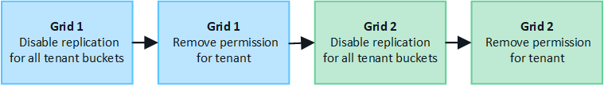

= Gerenciar os inquilinos permitidos para federação de rede
:allow-uri-read: 
:icons: font
:imagesdir: ../media/

[role="lead"]
Você pode permitir que contas de locatários do S3 usem uma conexão de federação de grade entre dois sistemas StorageGRID .  Quando os inquilinos têm permissão para usar uma conexão, etapas especiais são necessárias para editar os detalhes do inquilino ou remover permanentemente a permissão de um inquilino para usar a conexão.

.Antes de começar
* Você está conectado ao Grid Manager em qualquer uma das grades usando umlink:../admin/web-browser-requirements.html["navegador da web compatível"] .
* Você tem olink:admin-group-permissions.html["Permissão de acesso root"] para a grade na qual você está conectado.
* Você temlink:grid-federation-create-connection.html["criou uma conexão de federação de grade"] entre duas grades.
* Você revisou os fluxos de trabalho paralink:grid-federation-what-is-account-clone.html["clone de conta"] elink:grid-federation-what-is-cross-grid-replication.html["replicação entre grades"] .
* Conforme necessário, você já configurou o logon único (SSO) ou a federação de identidade para ambas as grades na conexão. Ver link:grid-federation-what-is-account-clone.html["O que é clone de conta"] .

== Criar um inquilino permitido

Se você deseja permitir que uma conta de locatário nova ou existente use uma conexão de federação de grade para clonagem de conta e replicação entre grades, siga as instruções gerais paralink:creating-tenant-account.html["criar um novo locatário S3"] oulink:editing-tenant-account.html["editar uma conta de inquilino"] e observe o seguinte:

* Você pode criar o locatário de qualquer grade na conexão.  A grade onde um locatário é criado é a _grade de origem do locatário_.
* O status da conexão deve ser *Conectado*.
* Quando o locatário é criado ou editado para habilitar a permissão *Usar conexão de federação de grade* e depois salvo na primeira grade, um locatário idêntico é replicado automaticamente para a outra grade.  A grade onde o locatário é replicado é a _grade de destino do locatário_.
* Os inquilinos em ambas as grades terão o mesmo ID de conta de 20 dígitos, nome, descrição, cota e permissões.  Opcionalmente, você pode usar o campo *Descrição* para ajudar a identificar qual é o locatário de origem e qual é o locatário de destino.  Por exemplo, esta descrição para um locatário criado na Grade 1 também aparecerá para o locatário replicado na Grade 2: "Este locatário foi criado na Grade 1".
* Por motivos de segurança, a senha de um usuário root local não é copiada para a grade de destino.
+

TIP: Antes que um usuário root local possa efetuar login no locatário replicado na grade de destino, um administrador de grade para essa grade develink:changing-password-for-tenant-local-root-user.html["alterar a senha do usuário root local"] .

* Depois que o novo locatário ou o locatário editado estiver disponível em ambas as grades, os usuários locatários poderão executar estas operações:
+
** Na grade de origem do locatário, crie grupos e usuários locais, que serão clonados automaticamente na grade de destino do locatário. Ver link:../tenant/grid-federation-account-clone.html["Clonar grupos de locatários e usuários"] .
** Crie novas chaves de acesso S3, que podem ser opcionalmente clonadas para a grade de destino do locatário. Ver link:../tenant/grid-federation-clone-keys-with-api.html["Clonar chaves de acesso S3 usando a API"] .
** Crie buckets idênticos em ambas as grades na conexão e habilite a replicação entre grades em uma direção ou em ambas as direções. Ver link:../tenant/grid-federation-manage-cross-grid-replication.html["Gerenciar replicação entre redes"] .

== Ver um inquilino permitido

Você pode ver detalhes de um locatário que tem permissão para usar uma conexão de federação de rede.

.Passos
. Selecione *LOCATÁRIOS*.
. Na página Inquilinos, selecione o nome do inquilino para visualizar a página de detalhes do inquilino.
+
Se esta for a grade de origem do locatário (ou seja, se o locatário foi criado nesta grade), um banner aparecerá para lembrá-lo de que o locatário foi clonado em outra grade.  Se você editar ou excluir este locatário, suas alterações não serão sincronizadas com a outra grade.

+
image::../media/grid-federation-tenant-detail.png[Guia de federação de grade da página de detalhes do locatário]

. Opcionalmente, selecione a aba *Federação de grade* paralink:../monitor/grid-federation-monitor-connections.html["monitorar a conexão da federação de rede"] .

== Editar um inquilino permitido

Se você precisar editar um locatário que tenha a permissão *Usar conexão de federação de grade*, siga as instruções gerais paralink:editing-tenant-account.html["editando uma conta de locatário"] e observe o seguinte:

* Se um locatário tiver a permissão *Usar conexão de federação de grade*, você poderá editar os detalhes do locatário de qualquer grade na conexão.  Entretanto, quaisquer alterações que você fizer não serão copiadas para a outra grade.  Se quiser manter os detalhes do inquilino sincronizados entre as grades, você deve fazer as mesmas edições em ambas as grades.
* Não é possível limpar a permissão *Usar conexão de federação de grade* quando você estiver editando um locatário.
* Não é possível selecionar uma conexão de federação de grade diferente ao editar um locatário.

== Excluir um inquilino permitido

Se você precisar remover um locatário que tenha a permissão *Usar conexão de federação de grade*, siga as instruções gerais paralink:deleting-tenant-account.html["excluindo uma conta de inquilino"] e observe o seguinte:

* Antes de remover o locatário original na grade de origem, você deve remover todos os buckets da conta na grade de origem.
* Antes de remover o locatário clonado na grade de destino, você deve remover todos os buckets da conta na grade de destino.
* Se você remover o locatário original ou clonado, a conta não poderá mais ser usada para replicação entre redes.
* Se você estiver removendo o locatário original na grade de origem, quaisquer grupos de locatários, usuários ou chaves que foram clonados na grade de destino não serão afetados.  Você pode excluir o locatário clonado ou permitir que ele gerencie seus próprios grupos, usuários, chaves de acesso e buckets.
* Se você estiver removendo o locatário clonado na grade de destino, ocorrerão erros de clonagem se novos grupos ou usuários forem adicionados ao locatário original.
+
Para evitar esses erros, remova a permissão do locatário para usar a conexão de federação da grade antes de excluir o locatário desta grade.

== [[remove-grid-federation-connection-permission]]Remover permissão de conexão de federação de grade

Para impedir que um locatário use uma conexão de federação de grade, você deve remover a permissão *Usar conexão de federação de grade*.

Antes de remover a permissão de um locatário para usar uma conexão de federação de grade, observe o seguinte:

* Você não pode remover a permissão *Usar conexão de federação de grade* se algum dos buckets do locatário tiver a replicação entre grades habilitada.  A conta do locatário deve primeiro desabilitar a replicação entre redes para todos os seus buckets.
* Remover a permissão *Usar conexão de federação de grade* não exclui nenhum item que já tenha sido replicado entre grades.  Por exemplo, quaisquer usuários, grupos e objetos locatários que existam em ambas as grades não serão excluídos de nenhuma delas quando a permissão do locatário for removida.  Se você quiser excluir esses itens, deverá excluí-los manualmente de ambas as grades.
* Se você quiser reativar essa permissão com a mesma conexão de federação de grade, exclua esse locatário na grade de destino primeiro; caso contrário, reativar essa permissão resultará em um erro.

NOTE: Reativar a permissão *Usar conexão de federação de grade* torna a grade local a grade de origem e aciona a clonagem para a grade remota especificada pela conexão de federação de grade selecionada.  Se a conta do locatário já existir na grade remota, a clonagem resultará em um erro de conflito.

.Antes de começar
* Você está usando umlink:../admin/web-browser-requirements.html["navegador da web compatível"] .
* Você tem olink:admin-group-permissions.html["Permissão de acesso root"] para ambas as grades.

=== Desabilitar replicação para buckets de locatários

Como primeira etapa, desabilite a replicação entre grades para todos os buckets de locatários.

.Passos
. A partir de qualquer grade, faça login no Grid Manager a partir do nó de administração principal.
. Selecione *CONFIGURAÇÃO* > *Sistema* > *Federação de grade*.
. Selecione o nome da conexão para exibir seus detalhes.
. Na guia *Inquilinos permitidos*, determine se o inquilino está usando a conexão.
. Se o inquilino estiver listado, instrua-o alink:../tenant/grid-federation-manage-cross-grid-replication.html["desabilitar replicação entre redes"] para todos os seus buckets em ambas as grades na conexão.
+

TIP: Não é possível remover a permissão *Usar conexão de federação de grade* se algum bucket de locatário tiver replicação entre grades habilitada.  O locatário deve desabilitar a replicação entre grades para seus buckets em ambas as grades.

=== Remover permissão para inquilino

Depois que a replicação entre grades for desabilitada para buckets de locatários, você poderá remover a permissão do locatário para usar a conexão de federação de grade.

.Passos
. Sign in no Grid Manager a partir do nó de administração principal.
. Remova a permissão da página de federação do Grid ou da página de Tenants.
+
[role="tabbed-block"]
====
.Página da federação da grade
--
.. Selecione *CONFIGURAÇÃO* > *Sistema* > *Federação de grade*.
.. Selecione o nome da conexão para exibir sua página de detalhes.
.. Na aba *Inquilinos permitidos*, selecione o botão de opção para o inquilino.
.. Selecione *Remover permissão*.

--
.Página de inquilinos
--
.. Selecione *LOCATÁRIOS*.
.. Selecione o nome do inquilino para exibir a página de detalhes.
.. Na aba *Federação de grade*, selecione o botão de opção para a conexão.
.. Selecione *Remover permissão*.

--
====
. Revise os avisos na caixa de diálogo de confirmação e selecione *Remover*.
+
** Se a permissão puder ser removida, você retornará à página de detalhes e uma mensagem de sucesso será exibida.  Este locatário não pode mais usar a conexão de federação de rede.
** Se um ou mais buckets de locatários ainda tiverem a replicação entre grades habilitada, um erro será exibido.
+
image::../media/grid-federation-remove-permission-error.png[mensagem de erro exibida se o locatário tiver o cgr habilitado para um bucket]

+
Você pode fazer qualquer um dos seguintes:

+
*** (Recomendado.)  Sign in no Gerenciador de locatários e desative a replicação para cada um dos buckets do locatário. Ver link:../tenant/grid-federation-manage-cross-grid-replication.html["Gerenciar replicação entre redes"] .  Em seguida, repita as etapas para remover a permissão *Usar conexão de rede*.
*** Remova a permissão à força.  Veja a próxima seção.

. Vá para a outra grade e repita essas etapas para remover a permissão do mesmo locatário na outra grade.

== [[force_remove_permission]]Remover a permissão à força

Se necessário, você pode forçar a remoção da permissão de um locatário para usar uma conexão de federação de grade, mesmo que os buckets de locatário tenham a replicação entre grades habilitada.

Antes de retirar a permissão de um inquilino à força, observe as considerações gerais para<<remove-grid-federation-connection-permission,removendo a permissão>> bem como estas considerações adicionais:

* Se você remover a permissão *Usar conexão de federação de grade* à força, todos os objetos que estiverem com replicação pendente para a outra grade (ingeridos, mas ainda não replicados) continuarão sendo replicados.  Para evitar que esses objetos em processo cheguem ao bucket de destino, você deve remover a permissão do locatário na outra grade também.
* Quaisquer objetos ingeridos no bucket de origem após você remover a permissão *Usar conexão de federação de grade* nunca serão replicados para o bucket de destino.

.Passos
. Sign in no Grid Manager a partir do nó de administração principal.
. Selecione *CONFIGURAÇÃO* > *Sistema* > *Federação de grade*.
. Selecione o nome da conexão para exibir sua página de detalhes.
. Na aba *Inquilinos permitidos*, selecione o botão de opção para o inquilino.
. Selecione *Remover permissão*.
. Revise os avisos na caixa de diálogo de confirmação e selecione *Forçar remoção*.
+
Uma mensagem de sucesso é exibida.  Este locatário não pode mais usar a conexão de federação de rede.

. Conforme necessário, vá para a outra grade e repita essas etapas para forçar a remoção da permissão para a mesma conta de locatário na outra grade.  Por exemplo, você deve repetir essas etapas na outra grade para evitar que objetos em processo cheguem ao bucket de destino.

