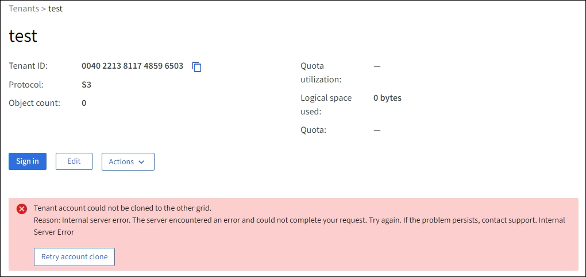

= Solucionar erros de federação de grade
:allow-uri-read: 
:icons: font
:imagesdir: ../media/

[role="lead"]
Pode ser necessário solucionar alertas e erros relacionados a conexões de federação de grade, clonagem de conta e replicação entre grades.

== [[grid-federation-errors]]Alertas e erros de conexão de federação de rede

Você pode receber alertas ou enfrentar erros com suas conexões de federação de rede.

Depois de fazer qualquer alteração para resolver um problema de conexão, teste a conexão para garantir que o status da conexão retorne para *Conectado*. Para obter instruções, consultelink:grid-federation-manage-connection.html["Gerenciar conexões de federação de grade"] .

=== Alerta de falha de conexão da federação de rede

.Emitir
O alerta *Falha na conexão da federação de rede* foi acionado.

.Detalhes
Este alerta indica que a conexão da federação de rede entre as redes não está funcionando.

.Ações recomendadas
. Revise as configurações na página Federação de grade para ambas as grades.  Confirme se todos os valores estão corretos. Ver link:grid-federation-manage-connection.html["Gerenciar conexões de federação de grade"] .
. Revise os certificados usados para a conexão.  Certifique-se de que não haja alertas para certificados de federação de grade expirados e que os detalhes de cada certificado sejam válidos.  Veja as instruções para rotação de certificados de conexão emlink:grid-federation-manage-connection.html["Gerenciar conexões de federação de grade"] .
. Confirme se todos os nós de administração e gateway em ambas as grades estão on-line e disponíveis.  Resolva quaisquer alertas que possam estar afetando esses nós e tente novamente.
. Se você forneceu um nome de domínio totalmente qualificado (FQDN) para a grade local ou remota, confirme se o servidor DNS está online e disponível.  Verlink:grid-federation-overview.html["O que é federação de grade?"] para requisitos de rede, endereço IP e DNS.

=== Alerta de expiração do certificado de federação de rede

.Emitir
O alerta *Expiração do certificado de federação de rede* foi acionado.

.Detalhes
Este alerta indica que um ou mais certificados de federação de grade estão prestes a expirar.

.Ações recomendadas
Veja as instruções para rotação de certificados de conexão emlink:grid-federation-manage-connection.html["Gerenciar conexões de federação de grade"] .

=== Erro ao editar uma conexão de federação de grade

.Emitir
Ao editar uma conexão de federação de grade, você verá a seguinte mensagem de aviso ao selecionar *Salvar e testar*: "Falha ao criar um arquivo de configuração candidato em um ou mais nós."

.Detalhes
Quando você edita uma conexão de federação de grade, o StorageGRID tenta salvar um arquivo de "configuração de candidato" em todos os nós de administração na primeira grade.  Uma mensagem de aviso será exibida se este arquivo não puder ser salvo em todos os nós administrativos, por exemplo, porque um nó administrativo está offline.

.Ações recomendadas
. Na grade que você está usando para editar a conexão, selecione *NÓS*.
. Confirme se todos os nós de administração dessa grade estão on-line.
. Se algum nó estiver offline, coloque-o online novamente e tente editar a conexão novamente.

== Erros de clonagem de conta

=== Não é possível fazer login em uma conta de locatário clonada

.Emitir
Você não pode entrar em uma conta de locatário clonada.  A mensagem de erro na página de login do Gerenciador de locatários é "Suas credenciais para esta conta eram inválidas.  Por favor, tente novamente."

.Detalhes
Por motivos de segurança, quando uma conta de locatário é clonada da grade de origem do locatário para a grade de destino do locatário, a senha definida para o usuário raiz local do locatário não é clonada.  Da mesma forma, quando um locatário cria usuários locais em sua grade de origem, as senhas dos usuários locais não são clonadas para a grade de destino.

.Ações recomendadas
Antes que o usuário root possa efetuar login na grade de destino do locatário, um administrador de grade deve primeirolink:changing-password-for-tenant-local-root-user.html["alterar a senha do usuário root local"] na grade de destino.

Antes que um usuário local clonado possa fazer login na grade de destino do locatário, o usuário raiz do locatário clonado deve adicionar uma senha para o usuário na grade de destino. Para obter instruções, consultelink:../tenant/managing-local-users.html["Gerenciar usuários locais"] nas instruções de uso do Gerenciador de Inquilinos.

=== Inquilino criado sem um clone

.Emitir
Você vê a mensagem "Locatário criado sem um clone" após criar um novo locatário com a permissão *Usar conexão de federação de grade*.

.Detalhes
Esse problema pode ocorrer se as atualizações do status da conexão forem atrasadas, o que pode fazer com que uma conexão não saudável seja listada como *Conectada*.

.Ações recomendadas
. Revise o motivo listado na mensagem de erro e resolva quaisquer problemas de rede ou outros que possam estar impedindo o funcionamento da conexão. Ver <<grid-federation-errors,Alertas e erros de conexão da federação de rede>> .
. Siga as instruções para testar uma conexão de federação de rede emlink:grid-federation-manage-connection.html["Gerenciar conexões de federação de grade"] para confirmar se o problema foi corrigido.
. Na grade de origem do locatário, selecione *LOCATÁRIOS*.
. Localize a conta do locatário que não foi clonada.
. Selecione o nome do inquilino para exibir a página de detalhes.
. Selecione *Repetir clonagem da conta*.
+

+
Se o erro tiver sido resolvido, a conta do locatário será clonada para a outra grade.

== Alertas e erros de replicação entre grades

=== Último erro mostrado para conexão ou locatário

.Emitir
Quandolink:../monitor/grid-federation-monitor-connections.html["visualizando uma conexão de federação de grade"] (ou quandolink:grid-federation-manage-tenants.html["gerenciando os inquilinos permitidos"] para uma conexão), você percebe um erro na coluna *Último erro* na página de detalhes da conexão. Por exemplo:

image::../media/grid-federation-last-error.png[Captura de tela mostrando uma mensagem na coluna Último erro de uma conexão de federação de grade]

.Detalhes
Para cada conexão de federação de grade, a coluna *Último erro* mostra o erro mais recente ocorrido, se houver, quando os dados de um locatário estavam sendo replicados para a outra grade. Esta coluna mostra apenas o último erro de replicação entre grades que ocorreu; erros anteriores que possam ter ocorrido não serão mostrados. Um erro nesta coluna pode ocorrer por um destes motivos:

* A versão do objeto de origem não foi encontrada.
* O bucket de origem não foi encontrado.
* O bucket de destino foi excluído.
* O bucket de destino foi recriado por uma conta diferente.
* O bucket de destino tem o controle de versão suspenso.
* O bucket de destino foi recriado pela mesma conta, mas agora não tem versão.

.Ações recomendadas
Se uma mensagem de erro aparecer na coluna *Último erro*, siga estas etapas:

. Revise o texto da mensagem.
. Execute todas as ações recomendadas.  Por exemplo, se o controle de versão foi suspenso no bucket de destino para replicação entre grades, reative o controle de versão para esse bucket.
. Selecione a conta de conexão ou locatário na tabela.
. Selecione *Limpar erro*.
. Selecione *Sim* para limpar a mensagem e atualizar o status do sistema.
. Espere de 5 a 6 minutos e então ingira um novo objeto no balde.  Confirme se a mensagem de erro não reaparece.
+

NOTE: Para garantir que a mensagem de erro seja apagada, aguarde pelo menos 5 minutos após o registro de data e hora na mensagem antes de ingerir um novo objeto.

+

TIP: Depois de limpar o erro, um novo *Último erro* pode aparecer se os objetos forem ingeridos em um bucket diferente que também tenha um erro.

. Para determinar se algum objeto não foi replicado devido ao erro do bucket, consultelink:../admin/grid-federation-retry-failed-replication.html["Identificar e tentar novamente operações de replicação com falha"] .

=== Alerta de falha permanente de replicação entre redes

.Emitir
O alerta *Falha permanente de replicação entre grades* foi acionado.

.Detalhes
Este alerta indica que os objetos do locatário não podem ser replicados entre os buckets em duas grades por um motivo que requer intervenção do usuário para ser resolvido.  Esse alerta geralmente é causado por uma alteração no bucket de origem ou de destino.

.Ações recomendadas
. Sign in na grade onde o alerta foi acionado.
. Vá para *CONFIGURAÇÃO* > *Sistema* > *Federação de grade* e localize o nome da conexão listado no alerta.
. Na guia Inquilinos permitidos, observe a coluna *Último erro* para determinar quais contas de inquilinos apresentam erros.
. Para saber mais sobre a falha, consulte as instruções emlink:../monitor/grid-federation-monitor-connections.html["Monitorar conexões de federação de rede"] para revisar as métricas de replicação entre grades.
. Para cada conta de locatário afetada:
+
.. Veja as instruções emlink:../monitor/monitoring-tenant-activity.html["Monitorar a atividade do inquilino"] para confirmar que o locatário não excedeu sua cota na grade de destino para replicação entre grades.
.. Conforme necessário, aumente a cota do locatário na grade de destino para permitir que novos objetos sejam salvos.

. Para cada locatário afetado, faça login no Gerenciador de Locatários em ambas as grades para poder comparar a lista de buckets.
. Para cada bucket que tenha replicação entre grades habilitada, confirme o seguinte:
+
** Há um bucket correspondente para o mesmo locatário na outra grade (é necessário usar o nome exato).
** Ambos os buckets têm o controle de versão de objetos habilitado (o controle de versão não pode ser suspenso em nenhuma das grades).
** Ambos os buckets têm o bloqueio de objeto S3 desabilitado.
** Nenhum bucket está no estado *Excluindo objetos: somente leitura*.

. Para confirmar se o problema foi resolvido, consulte as instruções emlink:../monitor/grid-federation-monitor-connections.html["Monitorar conexões de federação de rede"] para revisar as métricas de replicação entre grades ou executar estas etapas:
+
.. Volte para a página da federação Grid.
.. Selecione o inquilino afetado e selecione *Limpar erro* na coluna *Último erro*.
.. Selecione *Sim* para limpar a mensagem e atualizar o status do sistema.
.. Espere de 5 a 6 minutos e então ingira um novo objeto no balde.  Confirme se a mensagem de erro não reaparece.
+

NOTE: Para garantir que a mensagem de erro seja apagada, aguarde pelo menos 5 minutos após o registro de data e hora na mensagem antes de ingerir um novo objeto.

+

NOTE: Pode levar até um dia para que o alerta desapareça após ser resolvido.

.. Vá paralink:grid-federation-retry-failed-replication.html["Identificar e tentar novamente operações de replicação com falha"] para identificar quaisquer objetos ou excluir marcadores que não foram replicados para a outra grade e tentar replicar novamente conforme necessário.

=== Alerta de recurso de replicação entre grades indisponível

.Emitir
O alerta *Recurso de replicação entre grades indisponível* foi acionado.

.Detalhes
Este alerta indica que solicitações de replicação entre grades estão pendentes porque um recurso não está disponível.  Por exemplo, pode haver um erro de rede.

.Ações recomendadas
. Monitore o alerta para ver se o problema se resolve sozinho.
. Se o problema persistir, determine se alguma das grades tem um alerta *Falha na conexão da federação da grade* para a mesma conexão ou um alerta *Não foi possível comunicar com o nó* para um nó.  Este alerta pode ser resolvido quando você resolver esses alertas.
. Para saber mais sobre a falha, consulte as instruções emlink:../monitor/grid-federation-monitor-connections.html["Monitorar conexões de federação de rede"] para revisar as métricas de replicação entre grades.
. Se você não conseguir resolver o alerta, entre em contato com o suporte técnico.

A replicação entre redes continuará normalmente após o problema ser resolvido.
