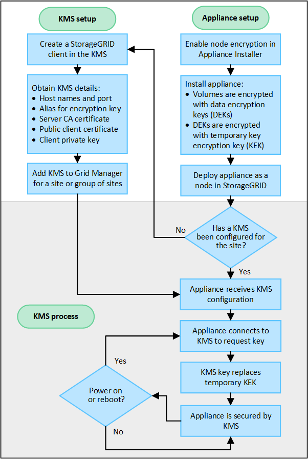

= Configuração do KMS e do dispositivo
:allow-uri-read: 
:icons: font
:imagesdir: ../media/

[role="lead"]
Antes de poder usar um servidor de gerenciamento de chaves (KMS) para proteger dados do StorageGRID em nós do dispositivo, você deve concluir duas tarefas de configuração: configurar um ou mais servidores KMS e habilitar a criptografia de nós para os nós do dispositivo.  Quando essas duas tarefas de configuração são concluídas, o processo de gerenciamento de chaves ocorre automaticamente.

O fluxograma mostra as etapas de alto nível para usar um KMS para proteger dados do StorageGRID em nós do dispositivo.

O fluxograma mostra a configuração do KMS e a configuração do dispositivo ocorrendo em paralelo; no entanto, você pode configurar os servidores de gerenciamento de chaves antes ou depois de habilitar a criptografia de nós para novos nós do dispositivo, com base em seus requisitos.

== Configurar o servidor de gerenciamento de chaves (KMS)

A configuração de um servidor de gerenciamento de chaves inclui as seguintes etapas de alto nível.

[cols="1a,1a"]
|===
| Etapa | Consulte 

 a| 
Acesse o software KMS e adicione um cliente para StorageGRID a cada KMS ou cluster KMS.
 a| 
link:kms-configuring-storagegrid-as-client.html["Configurar o StorageGRID como um cliente no KMS"]

 a| 
Obtenha as informações necessárias para o cliente StorageGRID no KMS.
 a| 
link:kms-configuring-storagegrid-as-client.html["Configurar o StorageGRID como um cliente no KMS"]

 a| 
Adicione o KMS ao Grid Manager, atribua-o a um único site ou a um grupo padrão de sites, carregue os certificados necessários e salve a configuração do KMS.
 a| 
link:kms-adding.html["Adicionar um servidor de gerenciamento de chaves (KMS)"]

|===

== Configurar o aparelho

A configuração de um nó de dispositivo para uso do KMS inclui as seguintes etapas de alto nível.

. Durante o estágio de configuração de hardware da instalação do dispositivo, use o StorageGRID Appliance Installer para habilitar a configuração *Criptografia de nó* para o dispositivo.
+

NOTE: Não é possível habilitar a configuração *Criptografia de nó* depois que um dispositivo é adicionado à grade e não é possível usar o gerenciamento de chaves externas para dispositivos que não tenham a criptografia de nó habilitada.

. Execute o instalador do dispositivo StorageGRID .  Durante a instalação, uma chave de criptografia de dados aleatória (DEK) é atribuída a cada volume do dispositivo, da seguinte forma:
+
** Os DEKs são usados para criptografar os dados em cada volume.  Essas chaves são geradas usando a criptografia de disco Linux Unified Key Setup (LUKS) no sistema operacional do dispositivo e não podem ser alteradas.
** Cada DEK individual é criptografado por uma chave mestra de criptografia (KEK).  A KEK inicial é uma chave temporária que criptografa os DEKs até que o dispositivo possa se conectar ao KMS.

. Adicione o nó do dispositivo ao StorageGRID.

Ver https://docs.netapp.com/us-en/storagegrid-appliances/installconfig/optional-enabling-node-encryption.html["Habilitar criptografia de nó"^] para mais detalhes.

== Processo de criptografia de gerenciamento de chaves (ocorre automaticamente)

A criptografia de gerenciamento de chaves inclui as seguintes etapas de alto nível que são executadas automaticamente.

. Quando você instala um dispositivo com criptografia de nó habilitada na grade, o StorageGRID determina se existe uma configuração KMS para o site que contém o novo nó.
+
** Se um KMS já tiver sido configurado para o site, o dispositivo receberá a configuração do KMS.
** Se um KMS ainda não tiver sido configurado para o site, os dados no dispositivo continuarão sendo criptografados pela KEK temporária até que você configure um KMS para o site e o dispositivo receba a configuração do KMS.

. O dispositivo usa a configuração do KMS para se conectar ao KMS e solicitar uma chave de criptografia.
. O KMS envia uma chave de criptografia para o dispositivo.  A nova chave do KMS substitui a KEK temporária e agora é usada para criptografar e descriptografar os DEKs para os volumes do dispositivo.
+

CAUTION: Todos os dados existentes antes do nó do dispositivo criptografado se conectar ao KMS configurado são criptografados com uma chave temporária.  No entanto, os volumes do dispositivo não devem ser considerados protegidos contra remoção do data center até que a chave temporária seja substituída pela chave de criptografia do KMS.

. Se o dispositivo for ligado ou reiniciado, ele se reconectará ao KMS para solicitar a chave.  A chave, que é salva na memória volátil, não sobrevive a uma queda de energia ou a uma reinicialização.

