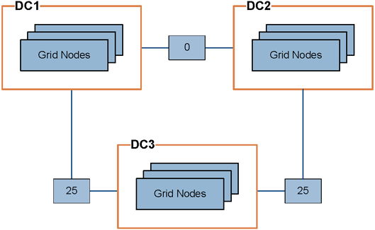

= Gerenciar custos de link
:allow-uri-read: 
:icons: font
:imagesdir: ../media/

[role="lead"]
Os custos de link permitem que você priorize qual site de data center fornece um serviço solicitado quando existem dois ou mais sites de data center.  Você pode ajustar os custos dos links para refletir a latência entre os sites.

== O que são custos de link?

* Os custos de link são usados para priorizar qual cópia de objeto é usada para atender às recuperações de objetos.
* Os custos de link são usados ​​pela API de gerenciamento de grade e pela API de gerenciamento de locatários para determinar quais serviços internos do StorageGRID usar.
* Os custos de link são usados pelo serviço Load Balancer em nós de administração e nós de gateway para direcionar conexões de clientes. Ver link:../admin/managing-load-balancing.html["Considerações para balanceamento de carga"] .

O diagrama mostra uma grade de três sites que tem custos de link configurados entre sites:

* O serviço Load Balancer nos nós de administração e nos nós de gateway distribui igualmente as conexões do cliente para todos os nós de armazenamento no mesmo site do data center e para quaisquer sites do data center com um custo de link de 0.
+
No exemplo, um nó de gateway no site do data center 1 (DC1) distribui igualmente conexões de clientes para nós de armazenamento no DC1 e para nós de armazenamento no DC2.  Um nó de gateway no DC3 envia conexões de cliente somente para nós de armazenamento no DC3.

* Ao recuperar um objeto que existe como várias cópias replicadas, o StorageGRID recupera a cópia no data center que tem o menor custo de link.
+
No exemplo, se um aplicativo cliente no DC2 recupera um objeto armazenado tanto no DC1 quanto no DC3, o objeto é recuperado do DC1, porque o custo do link do DC1 para o DC2 é 0, que é menor que o custo do link do DC3 para o DC2 (25).

Os custos de link são números relativos arbitrários, sem unidade de medida específica.  Por exemplo, um custo de link de 50 é usado com menos preferência do que um custo de link de 25.  A tabela mostra os custos de link comumente usados.

[cols="1a,1a,2a"]
|===
| Link | Custo do link | Notas 

 a| 
Entre locais de data center físico
 a| 
25 (padrão)
 a| 
Data centers conectados por um link WAN.

 a| 
Entre sites de data center lógicos no mesmo local físico
 a| 
0
 a| 
Data centers lógicos no mesmo prédio físico ou campus conectados por uma LAN.

|===

== Atualizar custos de link

Você pode atualizar os custos de link entre sites de data center para refletir a latência entre sites.

.Antes de começar
* Você está conectado ao Grid Manager usando umlink:../admin/web-browser-requirements.html["navegador da web compatível"] .
* Você tem olink:admin-group-permissions.html["Permissão de configuração da página de topologia de grade"] .

.Passos
. Selecione *SUPORTE* > *Outro* > *Custo do link*.
+
image::../media/configuring_link_costs.png[Custo do link]

. Selecione um site em *Origem do link* e insira um valor de custo entre 0 e 100 em *Destino do link*.
+
Você não pode alterar o custo do link se a origem for a mesma que o destino.

+
Para cancelar as alterações, selecioneimage:../media/nms_revert.gif["ícone desfazer"] *Reverter*.

. Selecione *Aplicar alterações*.

