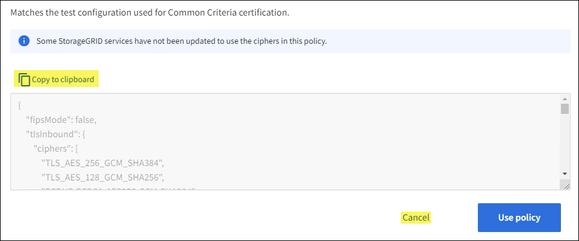

= Gerenciar a política TLS e SSH
:allow-uri-read: 
:icons: font
:imagesdir: ../media/

[role="lead"]
A política TLS e SSH determina quais protocolos e cifras são usados ​​para estabelecer conexões TLS seguras com aplicativos cliente e conexões SSH seguras com serviços internos do StorageGRID .

A política de segurança controla como TLS e SSH criptografam dados em movimento. Em geral, use a política de compatibilidade Moderna (padrão), a menos que seu sistema precise ser compatível com os Critérios Comuns ou você precise usar outras cifras.

NOTE: Alguns serviços do StorageGRID não foram atualizados para usar as cifras nessas políticas.

.Antes de começar
* Você está conectado ao Grid Manager usando umlink:../admin/web-browser-requirements.html["navegador da web compatível"] .
* Você tem olink:admin-group-permissions.html["Permissão de acesso root"] .

== Selecione uma política de segurança

.Passos
. Selecione *CONFIGURAÇÃO* > *Segurança* > *Configurações de segurança*.
+
A aba *Políticas TLS e SSH* mostra as políticas disponíveis.  A política atualmente ativa é indicada por uma marca de seleção verde no bloco de políticas.

+
image::../media/securitysettings_tls_ssh_policies_current.png[Políticas TLS e SSH]

. Revise os blocos para saber mais sobre as políticas disponíveis.
+
[cols="1a,2a"]
|===
| Política | Descrição 

 a| 
Compatibilidade moderna (padrão)
 a| 
Use a política padrão se precisar de criptografia forte e a menos que tenha requisitos especiais. Esta política é compatível com a maioria dos clientes TLS e SSH.

 a| 
Compatibilidade com legados
 a| 
Use esta política se precisar de opções adicionais de compatibilidade para clientes mais antigos. As opções adicionais nesta política podem torná-la menos segura do que a política de compatibilidade moderna.

 a| 
Critérios comuns
 a| 
Use esta política se precisar da certificação Common Criteria.

 a| 
FIPS estrito
 a| 
Use esta política se você precisar de certificação Common Criteria e usar o NetApp Cryptographic Security Module 3.0.8 para conexões de clientes externos com endpoints do balanceador de carga, Tenant Manager e Grid Manager. Usar esta política pode reduzir o desempenho.

*Observação*: Depois de selecionar esta política, todos os nós devem serlink:../maintain/rolling-reboot-procedure.html["reiniciado de forma contínua"] para ativar o Módulo de Segurança Criptográfica NetApp . Use *Manutenção* > *Reinicialização contínua* para iniciar e monitorar reinicializações.

 a| 
Personalizado
 a| 
Crie uma política personalizada se precisar aplicar suas próprias cifras.

|===
. Para ver detalhes sobre as cifras, protocolos e algoritmos de cada política, selecione *Exibir detalhes*.
. Para alterar a política atual, selecione *Usar política*.
+
Uma marca de seleção verde aparece ao lado de *Política atual* no bloco de políticas.

== Crie uma política de segurança personalizada

Você pode criar uma política personalizada se precisar aplicar suas próprias cifras.

.Passos
. No bloco da política mais semelhante à política personalizada que você deseja criar, selecione *Exibir detalhes*.
. Selecione *Copiar para a área de transferência* e depois selecione *Cancelar*.
+

. No bloco *Política personalizada*, selecione *Configurar e usar*.
. Cole o JSON que você copiou e faça as alterações necessárias.
. Selecione *Usar política*.
+
Uma marca de seleção verde aparece ao lado de *Política atual* no bloco Política personalizada.

. Opcionalmente, selecione *Editar configuração* para fazer mais alterações na nova política personalizada.

== Reverter temporariamente para a política de segurança padrão

Se você configurou uma política de segurança personalizada, talvez não consiga fazer login no Grid Manager se a política TLS configurada for incompatível com alink:global-certificate-types.html["certificado de servidor configurado"] .

Você pode reverter temporariamente para a política de segurança padrão.

.Passos
. Efetue login em um nó de administração:
+
.. Digite o seguinte comando: `ssh admin@_Admin_Node_IP_`
.. Digite a senha listada no `Passwords.txt` arquivo.
.. Digite o seguinte comando para alternar para root: `su -`
.. Digite a senha listada no `Passwords.txt` arquivo.
+
Quando você está logado como root, o prompt muda de `$` para `#` .

. Execute o seguinte comando:
+
`restore-default-cipher-configurations`

. Em um navegador da Web, acesse o Grid Manager no mesmo nó de administração.
. Siga os passos em<<select-a-security-policy,Selecione uma política de segurança>> para configurar a política novamente.

