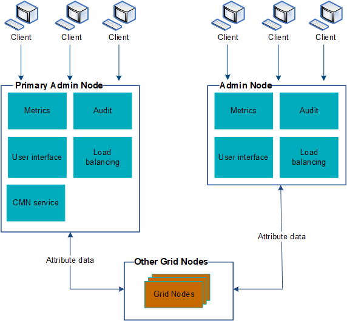

= Use vários nós de administração
:allow-uri-read: 
:icons: font
:imagesdir: ../media/

[role="lead"]
Um sistema StorageGRID pode incluir vários nós de administração para permitir que você monitore e configure continuamente seu sistema StorageGRID , mesmo se um nó de administração falhar.

Se um nó de administração ficar indisponível, o processamento de atributos continuará, os alertas ainda serão acionados e as notificações por e-mail e os pacotes de AutoSupport ainda serão enviados.  No entanto, ter vários nós de administração não fornece proteção contra failover, exceto para notificações e pacotes de AutoSupport .

Há duas opções para continuar a visualizar e configurar o sistema StorageGRID se um nó de administração falhar:

* Os clientes da Web podem se reconectar a qualquer outro nó de administração disponível.
* Se um administrador do sistema tiver configurado um grupo de alta disponibilidade de nós de administração, os clientes da Web poderão continuar acessando o Grid Manager ou o Tenant Manager usando o endereço IP virtual do grupo HA. Ver link:managing-high-availability-groups.html["Gerenciar grupos de alta disponibilidade"] .
+

NOTE: Ao usar um grupo HA, o acesso é interrompido se o nó de administração ativo falhar.  Os usuários devem efetuar login novamente depois que o endereço IP virtual do grupo HA falhar para outro nó de administração no grupo.

Algumas tarefas de manutenção só podem ser executadas usando o nó de administração principal.  Se o nó de administração primário falhar, ele deverá ser recuperado antes que o sistema StorageGRID esteja totalmente funcional novamente.
