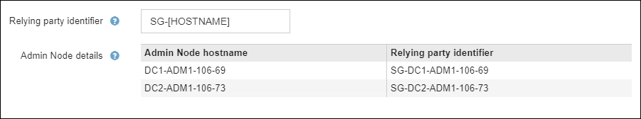

= Usar o modo sandbox
:allow-uri-read: 
:icons: font
:imagesdir: ../media/

[role="lead"]
Você pode usar o modo sandbox para configurar e testar o logon único (SSO) antes de habilitá-lo para todos os usuários do StorageGRID .  Após o SSO ser habilitado, você pode retornar ao modo sandbox sempre que precisar alterar ou testar novamente a configuração.

.Antes de começar
* Você está conectado ao Grid Manager usando umlink:../admin/web-browser-requirements.html["navegador da web compatível"] .
* Você tem olink:admin-group-permissions.html["Permissão de acesso root"] .
* Você configurou a federação de identidade para seu sistema StorageGRID .
* Para a federação de identidade *tipo de serviço LDAP*, você selecionou Active Directory ou Azure, com base no provedor de identidade SSO que planeja usar.
+
[cols="1a,1a"]
|===
| Tipo de serviço LDAP configurado | Opções para provedor de identidade SSO 

 a| 
Diretório ativo
 a| 
** Diretório ativo
** Azul
** PingFederate

 a| 
Azul
 a| 
Azul

|===

.Sobre esta tarefa
Quando o SSO está habilitado e um usuário tenta fazer login em um nó de administração, o StorageGRID envia uma solicitação de autenticação ao provedor de identidade do SSO.  Por sua vez, o provedor de identidade SSO envia uma resposta de autenticação de volta ao StorageGRID, indicando se a solicitação de autenticação foi bem-sucedida.  Para solicitações bem-sucedidas:

* A resposta do Active Directory ou PingFederate inclui um identificador universalmente exclusivo (UUID) para o usuário.
* A resposta do Azure inclui um Nome Principal do Usuário (UPN).

Para permitir que o StorageGRID (o provedor de serviços) e o provedor de identidade SSO se comuniquem com segurança sobre solicitações de autenticação do usuário, você deve configurar determinadas configurações no StorageGRID.  Em seguida, você deve usar o software do provedor de identidade SSO para criar uma parte confiável (AD FS), aplicativo empresarial (Azure) ou provedor de serviços (PingFederate) para cada nó de administração.  Por fim, você deve retornar ao StorageGRID para habilitar o SSO.

O modo sandbox facilita a execução dessa configuração de ida e volta e o teste de todas as suas configurações antes de habilitar o SSO. Quando você usa o modo sandbox, os usuários não conseguem fazer login usando SSO.

== Acessar o modo sandbox

.Passos
. Selecione *CONFIGURAÇÃO* > *Controle de acesso* > *Logon único*.
+
A página de logon único é exibida, com a opção *Desativado* selecionada.

+
image::../media/sso_status_disabled.png[Página de logon único com status SSO desabilitado]

+

NOTE: Se as opções de Status do SSO não aparecerem, confirme se você configurou o provedor de identidade como a fonte de identidade federada. Ver link:requirements-for-sso.html["Requisitos e considerações para logon único"] .

. Selecione *Modo Sandbox*.
+
A seção Provedor de Identidade é exibida.

== Insira os detalhes do provedor de identidade

.Passos
. Selecione o *tipo de SSO* na lista suspensa.
. Preencha os campos na seção Provedor de identidade com base no tipo de SSO selecionado.
+
[role="tabbed-block"]
====
.Diretório ativo
--
.. Insira o *Nome do serviço de federação* para o provedor de identidade, exatamente como ele aparece no Serviço de Federação do Active Directory (AD FS).
+

NOTE: Para localizar o nome do serviço de federação, acesse o Gerenciador do Windows Server.  Selecione *Ferramentas* > *Gerenciamento do AD FS*.  No menu Ação, selecione *Editar propriedades do serviço de federação*.  O nome do serviço da federação é mostrado no segundo campo.

.. Especifique qual certificado TLS será usado para proteger a conexão quando o provedor de identidade enviar informações de configuração de SSO em resposta às solicitações do StorageGRID .
+
*** *Usar certificado CA do sistema operacional*: Use o certificado CA padrão instalado no sistema operacional para proteger a conexão.
*** *Usar certificado CA personalizado*: Use um certificado CA personalizado para proteger a conexão.
+
Se você selecionar esta configuração, copie o texto do certificado personalizado e cole-o na caixa de texto *Certificado CA*.

*** *Não use TLS*: Não use um certificado TLS para proteger a conexão.
+

CAUTION: Se você alterar o certificado da CA, imediatamentelink:../maintain/starting-or-restarting-service.html["reinicie o serviço mgmt-api nos nós de administração"] e testar um SSO bem-sucedido no Grid Manager.

.. Na seção Parte Confiável, especifique o *Identificador da parte confiável* para StorageGRID. Este valor controla o nome que você usa para cada parte confiável no AD FS.
+
*** Por exemplo, se sua grade tiver apenas um nó de administração e você não pretende adicionar mais nós de administração no futuro, insira `SG` ou `StorageGRID` .
*** Se sua grade incluir mais de um nó de administração, inclua a string `[HOSTNAME]` no identificador. Por exemplo,  `SG-[HOSTNAME]` . Isso gera uma tabela que mostra o identificador da parte confiável para cada nó de administração no seu sistema, com base no nome do host do nó.
+

+

NOTE: Você deve criar uma parte confiável para cada nó de administração no seu sistema StorageGRID .  Ter uma parte confiável para cada nó administrativo garante que os usuários possam entrar e sair com segurança de qualquer nó administrativo.

.. Selecione *Salvar*.
+
Uma marca de seleção verde aparece no botão *Salvar* por alguns segundos.

+
image::../media/save_button_green_checkmark.gif[Botão Salvar com uma marca de seleção verde]

--
.Azul
--
.. Especifique qual certificado TLS será usado para proteger a conexão quando o provedor de identidade enviar informações de configuração de SSO em resposta às solicitações do StorageGRID .
+
*** *Usar certificado CA do sistema operacional*: Use o certificado CA padrão instalado no sistema operacional para proteger a conexão.
*** *Usar certificado CA personalizado*: Use um certificado CA personalizado para proteger a conexão.
+
Se você selecionar esta configuração, copie o texto do certificado personalizado e cole-o na caixa de texto *Certificado CA*.

*** *Não use TLS*: Não use um certificado TLS para proteger a conexão.
+

CAUTION: Se você alterar o certificado da CA, imediatamentelink:../maintain/starting-or-restarting-service.html["reinicie o serviço mgmt-api nos nós de administração"] e testar um SSO bem-sucedido no Grid Manager.

.. Na seção Aplicativo Corporativo, especifique o *Nome do aplicativo corporativo* para StorageGRID. Este valor controla o nome que você usa para cada aplicativo empresarial no Azure AD.
+
*** Por exemplo, se sua grade tiver apenas um nó de administração e você não pretende adicionar mais nós de administração no futuro, insira `SG` ou `StorageGRID` .
*** Se sua grade incluir mais de um nó de administração, inclua a string `[HOSTNAME]` no identificador. Por exemplo,  `SG-[HOSTNAME]` . Isso gera uma tabela que mostra um nome de aplicativo corporativo para cada nó de administração no seu sistema, com base no nome do host do nó.
+
image::../media/sso_status_sandbox_mode_azure.png[Login único,Sandbox mode enabled,Relying party identifiers shown for several Admin Nodes]

+

NOTE: Você deve criar um aplicativo corporativo para cada nó de administração no seu sistema StorageGRID .  Ter um aplicativo corporativo para cada nó administrativo garante que os usuários possam entrar e sair com segurança de qualquer nó administrativo.

.. Siga os passos emlink:../admin/creating-enterprise-application-azure.html["Crie aplicativos corporativos no Azure AD"] para criar um aplicativo corporativo para cada nó administrativo listado na tabela.
.. No Azure AD, copie a URL de metadados da federação para cada aplicativo empresarial. Em seguida, cole esta URL no campo *URL de metadados da federação* correspondente no StorageGRID.
.. Depois de copiar e colar uma URL de metadados de federação para todos os nós de administração, selecione *Salvar*.
+
Uma marca de seleção verde aparece no botão *Salvar* por alguns segundos.

+
image::../media/save_button_green_checkmark.gif[Botão Salvar com uma marca de seleção verde]

--
.PingFederate
--
.. Especifique qual certificado TLS será usado para proteger a conexão quando o provedor de identidade enviar informações de configuração de SSO em resposta às solicitações do StorageGRID .
+
*** *Usar certificado CA do sistema operacional*: Use o certificado CA padrão instalado no sistema operacional para proteger a conexão.
*** *Usar certificado CA personalizado*: Use um certificado CA personalizado para proteger a conexão.
+
Se você selecionar esta configuração, copie o texto do certificado personalizado e cole-o na caixa de texto *Certificado CA*.

*** *Não use TLS*: Não use um certificado TLS para proteger a conexão.
+

CAUTION: Se você alterar o certificado da CA, imediatamentelink:../maintain/starting-or-restarting-service.html["reinicie o serviço mgmt-api nos nós de administração"] e testar um SSO bem-sucedido no Grid Manager.

.. Na seção Provedor de serviços (SP), especifique o * ID de conexão do SP * para StorageGRID.  Este valor controla o nome que você usa para cada conexão SP no PingFederate.
+
*** Por exemplo, se sua grade tiver apenas um nó de administração e você não pretende adicionar mais nós de administração no futuro, insira `SG` ou `StorageGRID` .
*** Se sua grade incluir mais de um nó de administração, inclua a string `[HOSTNAME]` no identificador. Por exemplo,  `SG-[HOSTNAME]` . Isso gera uma tabela que mostra o ID de conexão do SP para cada nó de administração no seu sistema, com base no nome do host do nó.
+
image::../media/sso_status_sandbox_mode_ping_federated.png[Login único,Sandbox mode enabled,Relying party identifiers shown for several Admin Nodes]

+

NOTE: Você deve criar uma conexão SP para cada nó de administração no seu sistema StorageGRID .  Ter uma conexão SP para cada nó de administração garante que os usuários possam entrar e sair com segurança de qualquer nó de administração.

.. Especifique a URL de metadados da federação para cada nó administrativo no campo *URL de metadados da federação*.
+
Use o seguinte formato:

+
[listing]
----
https://<Federation Service Name>:<port>/pf/federation_metadata.ping?PartnerSpId=<SP Connection ID>
----
.. Selecione *Salvar*.
+
Uma marca de seleção verde aparece no botão *Salvar* por alguns segundos.

+
image::../media/save_button_green_checkmark.gif[Botão Salvar com uma marca de seleção verde]

--
====

== Configurar trusts de terceira parte confiável, aplicativos corporativos ou conexões SP

Quando a configuração é salva, o aviso de confirmação do modo Sandbox é exibido.  Este aviso confirma que o modo sandbox agora está ativado e fornece instruções gerais.

O StorageGRID pode permanecer no modo sandbox pelo tempo que for necessário. No entanto, quando o *Modo Sandbox* é selecionado na página de logon único, o SSO é desabilitado para todos os usuários do StorageGRID .  Somente usuários locais podem fazer login.

Siga estas etapas para configurar confianças de partes confiáveis ​​(Active Directory), aplicativos empresariais completos (Azure) ou configurar conexões SP (PingFederate).

[role="tabbed-block"]
====
.Diretório ativo
--
.Passos
. Acesse os Serviços de Federação do Active Directory (AD FS).
. Crie um ou mais trusts de parte confiável para o StorageGRID, usando cada identificador de parte confiável mostrado na tabela na página de logon único do StorageGRID .
+
Você deve criar uma confiança para cada nó administrativo mostrado na tabela.

+
Para obter instruções, acesselink:../admin/creating-relying-party-trusts-in-ad-fs.html["Criar relações de confiança de terceira parte confiável no AD FS"] .

--
.Azul
--
.Passos
. Na página de logon único do nó de administração no qual você está conectado no momento, selecione o botão para baixar e salvar os metadados SAML.
. Em seguida, para quaisquer outros nós de administração na sua grade, repita estas etapas:
+
.. Sign in no nó.
.. Selecione *CONFIGURAÇÃO* > *Controle de acesso* > *Logon único*.
.. Baixe e salve os metadados SAML para esse nó.

. Acesse o Portal do Azure.
. Siga os passos emlink:../admin/creating-enterprise-application-azure.html["Crie aplicativos corporativos no Azure AD"] para carregar o arquivo de metadados SAML para cada nó de administração em seu aplicativo empresarial do Azure correspondente.

--
.PingFederate
--
.Passos
. Na página de logon único do nó de administração no qual você está conectado no momento, selecione o botão para baixar e salvar os metadados SAML.
. Em seguida, para quaisquer outros nós de administração na sua grade, repita estas etapas:
+
.. Sign in no nó.
.. Selecione *CONFIGURAÇÃO* > *Controle de acesso* > *Logon único*.
.. Baixe e salve os metadados SAML para esse nó.

. Acesse PingFederate.
. link:../admin/creating-sp-connection-ping.html["Crie uma ou mais conexões de provedor de serviços (SP) para StorageGRID"] . Use o ID de conexão SP para cada nó de administração (mostrado na tabela na página de logon único do StorageGRID ) e os metadados SAML que você baixou para esse nó de administração.
+
Você deve criar uma conexão SP para cada nó de administração mostrado na tabela.

--
====

== Testar conexões SSO

Antes de impor o uso do logon único para todo o seu sistema StorageGRID , você deve confirmar se o logon único e o logout único estão configurados corretamente para cada nó de administração.

[role="tabbed-block"]
====
.Diretório ativo
--
.Passos
. Na página de logon único do StorageGRID , localize o link na mensagem do modo Sandbox.
+
O URL é derivado do valor inserido no campo *Nome do serviço da federação*.

+
image::../media/sso_sandbox_mode_url.gif[URL para página de login do provedor de identidade]

. Selecione o link ou copie e cole o URL em um navegador para acessar a página de login do seu provedor de identidade.
. Para confirmar que você pode usar o SSO para fazer login no StorageGRID, selecione * Sign in em um dos seguintes sites*, selecione o identificador de parte confiável para seu nó de administração principal e selecione * Sign in*.
+
image::../media/sso_sandbox_mode_testing.gif[Teste as partes confiáveis no modo SSO Sandbox]

. Digite seu nome de usuário e senha federados.
+
** Se as operações de login e logout do SSO forem bem-sucedidas, uma mensagem de sucesso será exibida.
+
image::../media/sso_sandbox_mode_sign_in_success.gif[Mensagem de sucesso no teste de autenticação e logout SSO]

** Se a operação SSO não for bem-sucedida, uma mensagem de erro será exibida.  Resolva o problema, limpe os cookies do navegador e tente novamente.

. Repita essas etapas para verificar a conexão SSO para cada nó de administração na sua grade.

--
.Azul
--
.Passos
. Acesse a página de logon único no portal do Azure.
. Selecione *Testar este aplicativo*.
. Insira as credenciais de um usuário federado.
+
** Se as operações de login e logout do SSO forem bem-sucedidas, uma mensagem de sucesso será exibida.
+
image::../media/sso_sandbox_mode_sign_in_success.gif[Mensagem de sucesso no teste de autenticação e logout SSO]

** Se a operação SSO não for bem-sucedida, uma mensagem de erro será exibida.  Resolva o problema, limpe os cookies do navegador e tente novamente.

. Repita essas etapas para verificar a conexão SSO para cada nó de administração na sua grade.

--
.PingFederate
--
.Passos
. Na página de logon único do StorageGRID , selecione o primeiro link na mensagem do modo Sandbox.
+
Selecione e teste um link por vez.

+
image::../media/sso_sandbox_mode_enabled_ping.png[Login único]

. Insira as credenciais de um usuário federado.
+
** Se as operações de login e logout do SSO forem bem-sucedidas, uma mensagem de sucesso será exibida.
+
image::../media/sso_sandbox_mode_sign_in_success.gif[Mensagem de sucesso no teste de autenticação e logout SSO]

** Se a operação SSO não for bem-sucedida, uma mensagem de erro será exibida.  Resolva o problema, limpe os cookies do navegador e tente novamente.

. Selecione o próximo link para verificar a conexão SSO para cada nó de administração na sua grade.
+
Se você vir uma mensagem de Página expirada, selecione o botão *Voltar* no seu navegador e reenvie suas credenciais.

--
====

== Habilitar logon único

Depois de confirmar que você pode usar o SSO para fazer login em cada nó de administração, você pode habilitar o SSO para todo o seu sistema StorageGRID .

TIP: Quando o SSO estiver habilitado, todos os usuários deverão usar o SSO para acessar o Grid Manager, o Tenant Manager, a Grid Management API e a Tenant Management API.  Usuários locais não podem mais acessar o StorageGRID.

.Passos
. Selecione *CONFIGURAÇÃO* > *Controle de acesso* > *Logon único*.
. Altere o status do SSO para *Habilitado*.
. Selecione *Salvar*.
. Revise a mensagem de aviso e selecione *OK*.
+
O logon único agora está habilitado.

TIP: Se você estiver usando o Portal do Azure e acessar o StorageGRID do mesmo computador que usa para acessar o Azure, certifique-se de que o usuário do Portal do Azure também seja um usuário autorizado do StorageGRID (um usuário em um grupo federado que foi importado para o StorageGRID) ou saia do Portal do Azure antes de tentar entrar no StorageGRID.
