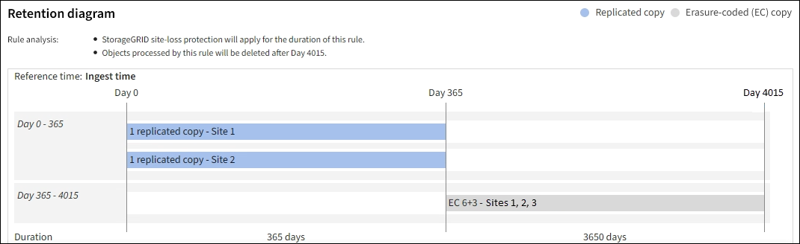

= Etapa 2 de 3: Definir posicionamentos
:allow-uri-read: 
:icons: font
:imagesdir: ../media/

[role="lead"]
A etapa *Definir posicionamentos* do assistente Criar regra ILM permite que você defina as instruções de posicionamento que determinam por quanto tempo os objetos são armazenados, o tipo de cópias (replicadas ou codificadas para eliminação), o local de armazenamento e o número de cópias.

NOTE: As capturas de tela mostradas são exemplos.  Seus resultados podem variar dependendo da versão do StorageGRID .

.Sobre esta tarefa
Uma regra ILM pode incluir uma ou mais instruções de posicionamento.  Cada instrução de colocação se aplica a um único período de tempo.  Quando você usa mais de uma instrução, os períodos de tempo devem ser contíguos e pelo menos uma instrução deve começar no dia 0.  As instruções podem continuar para sempre ou até que você não precise mais de cópias de objetos.

Cada instrução de posicionamento pode ter várias linhas se você quiser criar diferentes tipos de cópias ou usar locais diferentes durante esse período.

Neste exemplo, a regra ILM armazena uma cópia replicada no Site 1 e uma cópia replicada no Site 2 durante o primeiro ano.  Após um ano, uma cópia codificada para eliminação 2+1 é feita e salva em apenas um site.

image::../media/ilm_create_ilm_rule_wizard_2.png[Assistente para criar regra ILM - Etapa 2]

.Passos
. Para *Tempo de referência*, selecione o tipo de tempo a ser usado ao calcular o horário de início de uma instrução de posicionamento.
+
[cols="1a,2a"]
|===
| Opção | Descrição 

 a| 
Tempo de ingestão
 a| 
O momento em que o objeto foi ingerido.

 a| 
Último horário de acesso
 a| 
A hora em que o objeto foi recuperado (lido ou visualizado) pela última vez.

Para usar esta opção, as atualizações do Último horário de acesso devem ser habilitadas para o bucket S3. Consulte link:using-last-access-time-in-ilm-rules.html["Usar a hora do último acesso nas regras do ILM"] .

 a| 
Tempo de criação definido pelo usuário
 a| 
Um tempo especificado em metadados definidos pelo usuário.

 a| 
Tempo não atual
 a| 
"Tempo não atual" é selecionado automaticamente se você selecionou *Sim* para a pergunta "Aplicar esta regra somente a versões de objetos mais antigas (em buckets do S3 com controle de versão habilitado)?" emlink:create-ilm-rule-enter-details.html["Etapa 1 do assistente Criar uma regra ILM"] .

|===
+
Se você quiser criar uma regra _compatível_, selecione *Tempo de ingestão*. Consulte link:managing-objects-with-s3-object-lock.html["Gerenciar objetos com o S3 Object Lock"] .

. Na seção *Período de tempo e posicionamentos*, insira um horário de início e uma duração para o primeiro período de tempo.
+
Por exemplo, você pode querer especificar onde armazenar objetos durante o primeiro ano (_A partir do dia 0, armazenar por 365 dias_).  Pelo menos uma instrução deve começar no dia 0.

. Se você quiser criar cópias replicadas:
+
.. Na lista suspensa *Armazenar objetos por*, selecione *replicando*.
.. Selecione o número de cópias que você deseja fazer.
+
Um aviso aparecerá se você alterar o número de cópias para 1.  Uma regra de ILM que cria apenas uma cópia replicada para qualquer período de tempo coloca os dados em risco de perda permanente. Consulte link:why-you-should-not-use-single-copy-replication.html["Por que você não deve usar replicação de cópia única"] .

+
Para evitar o risco, faça uma ou mais das seguintes ações:

+
*** Aumentar o número de cópias para o período.
*** Adicione cópias a outros pools de armazenamento ou a um pool de armazenamento em nuvem.
*** Selecione *codificação de eliminação* em vez de *replicação*.
+
Você pode ignorar este aviso com segurança se esta regra já criar várias cópias para todos os períodos de tempo.

.. No campo *cópias em*, selecione os pools de armazenamento que deseja adicionar.
+
*Se você especificar apenas um pool de armazenamento*, esteja ciente de que o StorageGRID pode armazenar apenas uma cópia replicada de um objeto em qualquer nó de armazenamento.  Se sua grade incluir três nós de armazenamento e você selecionar 4 como o número de cópias, apenas três cópias serão feitas, uma cópia para cada nó de armazenamento.

+
O alerta *ILM placement unachievable* é acionado para indicar que a regra ILM não pôde ser aplicada completamente.

+
*Se você especificar mais de um pool de armazenamento*, tenha estas regras em mente:

+
*** O número de cópias não pode ser maior que o número de pools de armazenamento.
*** Se o número de cópias for igual ao número de pools de armazenamento, uma cópia do objeto será armazenada em cada pool de armazenamento.
*** Se o número de cópias for menor que o número de pools de armazenamento, uma cópia será armazenada no site de ingestão e, em seguida, o sistema distribui as cópias restantes para manter o uso do disco entre os pools equilibrado, garantindo que nenhum site receba mais de uma cópia de um objeto.
*** Se os pools de armazenamento se sobrepuserem (contiverem os mesmos nós de armazenamento), todas as cópias do objeto poderão ser salvas em apenas um site.  Por esse motivo, não especifique o pool de armazenamento All Storage Nodes (StorageGRID 11.6 e anteriores) e outro pool de armazenamento.

. Se você quiser criar uma cópia codificada para eliminação:
+
.. Na lista suspensa *Armazenar objetos por*, selecione *codificação de eliminação*.
+

NOTE: A codificação de eliminação é mais adequada para objetos maiores que 1 MB.  Não use codificação de eliminação para objetos menores que 200 KB para evitar a sobrecarga de gerenciamento de fragmentos muito pequenos codificados por eliminação.

.. Se você não adicionou um filtro de tamanho de objeto para um valor maior que 200 KB, selecione *Anterior* para retornar à Etapa 1.  Em seguida, selecione *Adicionar um filtro avançado* e defina um filtro *Tamanho do objeto* para qualquer valor maior que 200 KB.
.. Selecione o pool de armazenamento que deseja adicionar e o esquema de codificação de eliminação que deseja usar.
+
O local de armazenamento de uma cópia codificada para eliminação inclui o nome do esquema de codificação para eliminação, seguido pelo nome do pool de armazenamento.

+
Os esquemas de codificação de eliminação disponíveis são limitados pelo número de nós de armazenamento no pool de armazenamento selecionado.  UM `Recommended` O emblema aparece ao lado dos esquemas que fornecem olink:../ilm/what-erasure-coding-schemes-are.html["melhor proteção ou menor sobrecarga de armazenamento"] .

. Opcionalmente:
+
.. Selecione *Adicionar outro tipo ou local* para criar cópias adicionais em locais diferentes.
.. Selecione *Adicionar outro período de tempo* para adicionar períodos de tempo diferentes.
+
[NOTE]
====
As exclusões de objetos ocorrem com base nas seguintes configurações:

*** Os objetos são excluídos automaticamente no final do período de tempo final, a menos que outro período de tempo termine com *para sempre*.
*** Dependendo delink:../ilm/example-8-priorities-for-s3-bucket-lifecycle-and-ilm-policy.html#example-of-bucket-lifecycle-taking-priority-over-ilm-policy["configurações de período de retenção de bucket e locatário"] , os objetos podem não ser excluídos mesmo que o período de retenção do ILM termine.

====

. Se você quiser armazenar objetos em um pool de armazenamento em nuvem:
+
.. Na lista suspensa *Armazenar objetos por*, selecione *replicando*.
.. Selecione o campo *cópias em* e, em seguida, selecione um Pool de Armazenamento em Nuvem.
+
Ao usar pools de armazenamento em nuvem, tenha estas regras em mente:

+
*** Não é possível selecionar mais de um Cloud Storage Pool em uma única instrução de posicionamento.  Da mesma forma, você não pode selecionar um Cloud Storage Pool e um pool de armazenamento na mesma instrução de posicionamento.
*** Você pode armazenar apenas uma cópia de um objeto em qualquer pool de armazenamento em nuvem.  Uma mensagem de erro aparece se você definir *Cópias* como 2 ou mais.
*** Não é possível armazenar mais de uma cópia de objeto em nenhum pool de armazenamento em nuvem ao mesmo tempo.  Uma mensagem de erro será exibida se vários posicionamentos que usam um pool de armazenamento em nuvem tiverem datas sobrepostas ou se várias linhas no mesmo posicionamento usarem um pool de armazenamento em nuvem.
*** Você pode armazenar um objeto em um Cloud Storage Pool ao mesmo tempo em que ele está sendo armazenado como cópias replicadas ou codificadas para eliminação no StorageGRID.  No entanto, você deve incluir mais de uma linha na instrução de posicionamento para o período de tempo, para que possa especificar o número e os tipos de cópias para cada local.

. No diagrama de retenção, confirme suas instruções de posicionamento.
+
Neste exemplo, a regra ILM armazena uma cópia replicada no Site 1 e uma cópia replicada no Site 2 durante o primeiro ano.  Após um ano e por mais 10 anos, uma cópia codificada para eliminação 6+3 será salva em três locais.  Após 11 anos no total, os objetos serão excluídos do StorageGRID.

+
A seção Análise de regras do diagrama de retenção afirma:

+
** A proteção contra perda de site do StorageGRID será aplicada durante a vigência desta regra.
** Os objetos processados por esta regra serão excluídos após o Dia 4015.
+
Consulte link:using-multiple-storage-pools-for-cross-site-replication.html["Ative a proteção contra perda de site."]

+

. Selecione *Continuar*. link:create-ilm-rule-select-ingest-behavior.html["Etapa 3 (Selecionar comportamento de ingestão)"]do assistente Criar uma regra ILM é exibido.

