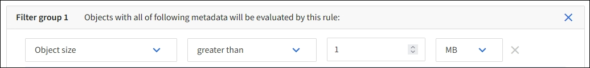

= Exemplo 2: regras e políticas do ILM para filtragem de tamanho de objeto EC
:allow-uri-read: 
:icons: font
:imagesdir: ../media/

[role="lead"]
Você pode usar as seguintes regras e políticas de exemplo como pontos de partida para definir uma política de ILM que filtre por tamanho de objeto para atender aos requisitos de EC recomendados.

CAUTION: As seguintes regras e políticas do ILM são apenas exemplos.  Há muitas maneiras de configurar regras de ILM.  Antes de ativar uma nova política, simule-a para confirmar se ela funcionará conforme o esperado para proteger o conteúdo contra perdas.

== Regra 1 do ILM, exemplo 2: Use EC para objetos maiores que 1 MB

Este exemplo de regra de eliminação do ILM codifica objetos maiores que 1 MB.

NOTE: A codificação de eliminação é mais adequada para objetos maiores que 1 MB.  Não use codificação de eliminação para objetos menores que 200 KB para evitar a sobrecarga de gerenciamento de fragmentos muito pequenos codificados por eliminação.

[cols="2a,2a"]
|===
| Definição de regra | Valor de exemplo 

 a| 
Nome da regra
 a| 
Objetos somente EC > 1 MB

 a| 
Tempo de referência
 a| 
Tempo de ingestão

 a| 
Filtro avançado para tamanho do objeto
 a| 
Tamanho do objeto maior que 1 MB

 a| 
Posicionamentos
 a| 
Crie uma cópia codificada para eliminação 2+1 usando três sites

|===

== Regra 2 do ILM, por exemplo 2: Duas cópias replicadas

Este exemplo de regra ILM cria duas cópias replicadas e não filtra por tamanho do objeto.  Esta regra é a regra padrão para a política.  Como a primeira regra filtra todos os objetos maiores que 1 MB, esta regra só se aplica a objetos com 1 MB ou menos.

[cols="1a,2a"]
|===
| Definição de regra | Valor de exemplo 

 a| 
Nome da regra
 a| 
Duas cópias replicadas

 a| 
Tempo de referência
 a| 
Tempo de ingestão

 a| 
Filtro avançado para tamanho do objeto
 a| 
Nenhum

 a| 
Posicionamentos
 a| 
Do Dia 0 até sempre, mantenha uma cópia replicada no Site 1 e uma cópia replicada no Site 2.

|===

== Política ILM para exemplo 2: Usar EC para objetos maiores que 1 MB

Este exemplo de política de ILM inclui duas regras de ILM:

* A primeira regra de eliminação codifica todos os objetos maiores que 1 MB.
* A segunda regra ILM (padrão) cria duas cópias replicadas.  Como objetos maiores que 1 MB foram filtrados pela regra 1, a regra 2 se aplica somente a objetos com 1 MB ou menos.

