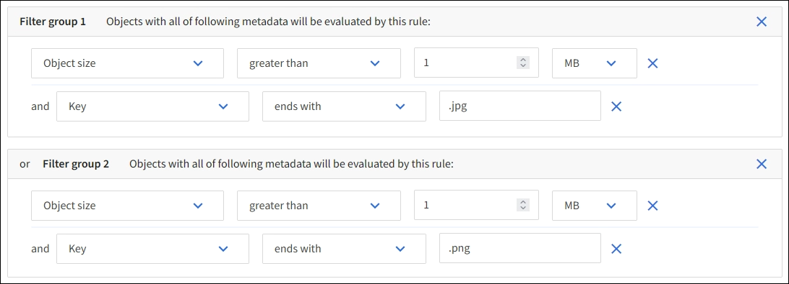

= Exemplo 3: Regras e políticas do ILM para melhor proteção de arquivos de imagem
:allow-uri-read: 
:icons: font
:imagesdir: ../media/

[role="lead"]
Você pode usar os seguintes exemplos de regras e políticas para garantir que imagens maiores que 1 MB sejam codificadas para eliminação e que duas cópias sejam feitas de imagens menores.

CAUTION: As seguintes regras e políticas do ILM são apenas exemplos.  Há muitas maneiras de configurar regras de ILM.  Antes de ativar uma nova política, simule-a para confirmar se ela funcionará conforme o esperado para proteger o conteúdo contra perdas.

== Regra 1 do ILM, exemplo 3: Use EC para arquivos de imagem maiores que 1 MB

Este exemplo de regra ILM usa filtragem avançada para apagar o código de todos os arquivos de imagem maiores que 1 MB.

NOTE: A codificação de eliminação é mais adequada para objetos maiores que 1 MB.  Não use codificação de eliminação para objetos menores que 200 KB para evitar a sobrecarga de gerenciamento de fragmentos muito pequenos codificados por eliminação.

[cols="1a,2a"]
|===
| Definição de regra | Valor de exemplo 

 a| 
Nome da regra
 a| 
Arquivos de imagem EC > 1 MB

 a| 
Tempo de referência
 a| 
Tempo de ingestão

 a| 
Filtro avançado para tamanho do objeto
 a| 
Tamanho do objeto maior que 1 MB

 a| 
Filtros avançados para Chave
 a| 
* Termina com .jpg
* Termina com .png

 a| 
Posicionamentos
 a| 
Crie uma cópia codificada para eliminação 2+1 usando três sites

|===

Como essa regra é configurada como a primeira regra na política, a instrução de posicionamento de codificação de eliminação só se aplica a arquivos .jpg e .png maiores que 1 MB.

== Regra 2 do ILM, exemplo 3: Crie 2 cópias replicadas para todos os arquivos de imagem restantes

Este exemplo de regra ILM usa filtragem avançada para especificar que arquivos de imagem menores sejam replicados.  Como a primeira regra da política já correspondeu a arquivos de imagem maiores que 1 MB, esta regra se aplica a arquivos de imagem com 1 MB ou menos.

[cols="1a,2a"]
|===
| Definição de regra | Valor de exemplo 

 a| 
Nome da regra
 a| 
2 cópias para arquivos de imagem

 a| 
Tempo de referência
 a| 
Tempo de ingestão

 a| 
Filtros avançados para Chave
 a| 
* Termina com .jpg
* Termina com .png

 a| 
Posicionamentos
 a| 
Crie 2 cópias replicadas em dois pools de armazenamento

|===

== Política de ILM, exemplo 3: Melhor proteção para arquivos de imagem

Este exemplo de política de ILM inclui três regras:

* A primeira regra de eliminação codifica todos os arquivos de imagem maiores que 1 MB.
* A segunda regra cria duas cópias de quaisquer arquivos de imagem restantes (ou seja, imagens com 1 MB ou menos).
* A regra padrão se aplica a todos os objetos restantes (ou seja, quaisquer arquivos que não sejam de imagem).

image::../media/policy_3_configured_policy.png[Política de ILM, exemplo 3: Melhor proteção para arquivos de imagem]
