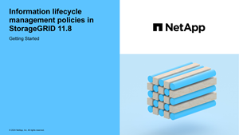

= Gerenciar objetos com ILM
:allow-uri-read: 
:icons: font
:imagesdir: ../media/

[role="lead"]
As regras de gerenciamento do ciclo de vida das informações (ILM) em uma política de ILM instruem o StorageGRID sobre como criar e distribuir cópias de dados de objetos e como gerenciar essas cópias ao longo do tempo.

== Sobre estas instruções

Projetar e implementar regras e políticas de ILM exige um planejamento cuidadoso.  Você deve entender seus requisitos operacionais, a topologia do seu sistema StorageGRID , suas necessidades de proteção de objetos e os tipos de armazenamento disponíveis.  Em seguida, você deve determinar como deseja que diferentes tipos de objetos sejam copiados, distribuídos e armazenados.

Use estas instruções para:

* Saiba mais sobre o StorageGRID ILM, incluindolink:how-ilm-operates-throughout-objects-life.html["como o ILM opera ao longo da vida de um objeto"] .
* Aprenda a configurarlink:what-storage-pool-is.html["pools de armazenamento"] ,link:what-cloud-storage-pool-is.html["Pools de armazenamento em nuvem"] , elink:what-ilm-rule-is.html["Regras do ILM"] .
* Aprenda comolink:creating-ilm-policy.html["criar, simular e ativar uma política de ILM"] que protegerá dados de objetos em um ou mais sites.
* Aprenda comolink:managing-objects-with-s3-object-lock.html["gerenciar objetos com S3 Object Lock"] , o que ajuda a garantir que objetos em buckets S3 específicos não sejam excluídos ou substituídos por um período de tempo especificado.

== Saber mais

Para saber mais, assista a estes vídeos:

* https://netapp.hosted.panopto.com/Panopto/Pages/Viewer.aspx?id=9872d38f-80b3-4ad4-9f79-b1ff008760c7["Vídeo: Visão geral das regras do ILM"^] .
+
[link=https://netapp.hosted.panopto.com/Panopto/Pages/Viewer.aspx?id=9872d38f-80b3-4ad4-9f79-b1ff008760c7]
image::../media/video-screenshot-ilm-rules-118.png[Vídeo: Visão geral das regras do ILM]

* https://netapp.hosted.panopto.com/Panopto/Pages/Viewer.aspx?id=e768d4da-da88-413c-bbaa-b1ff00874d10["Vídeo: Visão geral das políticas do ILM"^]
+
[link=https://netapp.hosted.panopto.com/Panopto/Pages/Viewer.aspx?id=e768d4da-da88-413c-bbaa-b1ff00874d10]

