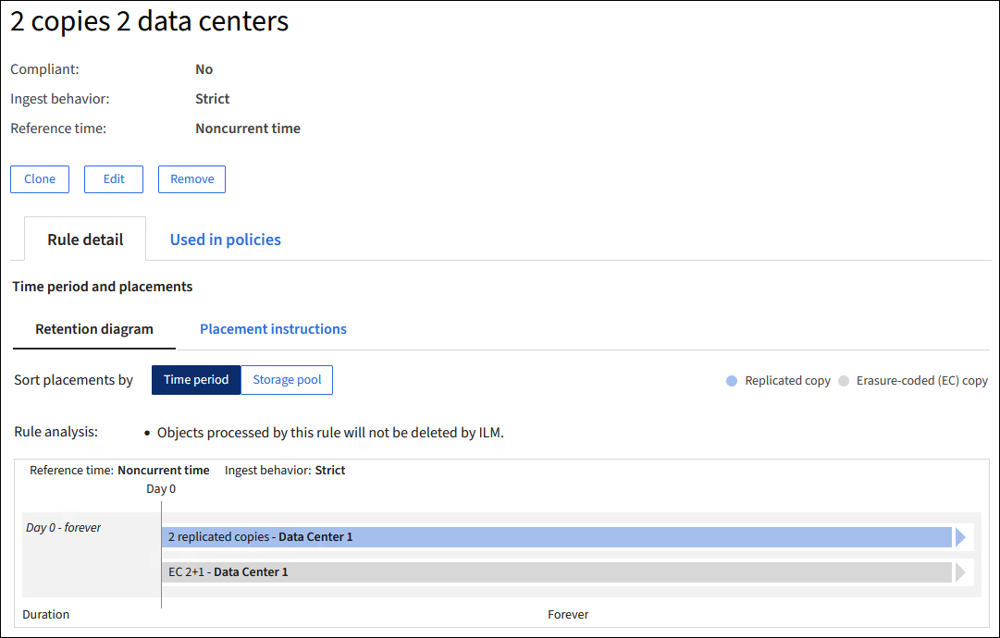

= Trabalhar com políticas e regras do ILM
:allow-uri-read: 
:icons: font
:imagesdir: ../media/

[role="lead"]
À medida que seus requisitos de armazenamento mudam, pode ser necessário implementar políticas adicionais ou modificar as regras de ILM associadas a uma política.  Você pode visualizar métricas do ILM para determinar o desempenho do sistema.

.Antes de começar
* Você está conectado ao Grid Manager usando umlink:../admin/web-browser-requirements.html["navegador da web compatível"] .
* Você temlink:../admin/admin-group-permissions.html["permissões de acesso específicas"] .

== Ver políticas do ILM

Para visualizar políticas de ILM ativas e inativas e o histórico de ativação de políticas:

. Selecione *ILM* > *Políticas*.
. Selecione *Políticas* para visualizar uma lista de políticas ativas e inativas.  A tabela lista o nome de cada política, as tags às quais a política está atribuída e se a política está ativa ou inativa.
. Selecione *Histórico de ativação* para visualizar uma lista de datas de início e término de ativação das políticas.
. Selecione um nome de política para visualizar os detalhes da política.
+

NOTE: Se você visualizar os detalhes de uma política cujo status é Editado ou Excluído, uma mensagem será exibida explicando que você está visualizando a versão da política que estava ativa durante o período especificado e que desde então foi editada ou excluída.

== Editar uma política de ILM

Você só pode editar uma política inativa.  Se você quiser editar uma política ativa, desative-a ou crie um clone e edite o clone.

Para editar uma política:

. Selecione *ILM* > *Políticas*.
. Marque a caixa de seleção da política que você deseja editar e selecione *Editar*.
. Edite a política seguindo as instruções emlink:creating-ilm-policy.html["Criar políticas de ILM"] .
. Simule a política antes de reativá-la.

CAUTION: Uma política de ILM configurada incorretamente pode resultar em perda irrecuperável de dados.  Antes de ativar uma política de ILM, revise cuidadosamente a política de ILM e suas regras de ILM e, em seguida, simule a política de ILM.  Sempre confirme se a política de ILM funcionará conforme o esperado.

== Clonar uma política de ILM

Para clonar uma política ILM:

. Selecione *ILM* > *Políticas*.
. Marque a caixa de seleção da política que você deseja clonar e selecione *Clonar*.
. Crie uma nova política começando com a política que você clonou seguindo as instruções emlink:creating-ilm-policy.html["Criar políticas de ILM"] .

CAUTION: Uma política de ILM configurada incorretamente pode resultar em perda irrecuperável de dados.  Antes de ativar uma política de ILM, revise cuidadosamente a política de ILM e suas regras de ILM e, em seguida, simule a política de ILM.  Sempre confirme se a política de ILM funcionará conforme o esperado.

== Remover uma política de ILM

Você só pode remover uma política de ILM se ela estiver inativa.  Para remover uma política:

. Selecione *ILM* > *Políticas*.
. Marque a caixa de seleção da política inativa que você deseja remover.
. Selecione *Remover*.

== Ver detalhes da regra do ILM

Para visualizar os detalhes de uma regra ILM, incluindo o diagrama de retenção e as instruções de posicionamento da regra:

. Selecione *ILM* > *Regras*.
. Selecione o nome da regra cujos detalhes você deseja visualizar. Exemplo:
+

Além disso, você pode usar a página de detalhes para clonar, editar ou remover uma regra.  Você não pode editar ou remover uma regra se ela for usada em qualquer política.

== Clonar uma regra ILM

Você pode clonar uma regra existente se quiser criar uma nova regra que use algumas das configurações da regra existente.  Se você precisar editar uma regra usada em qualquer política, clone a regra e faça alterações no clone.  Depois de fazer alterações no clone, você pode remover a regra original da política e substituí-la pela versão modificada, conforme necessário.

NOTE: Não é possível clonar uma regra do ILM se ela foi criada usando o StorageGRID versão 10.2 ou anterior.

.Passos
. Selecione *ILM* > *Regras*.
. Marque a caixa de seleção da regra que você deseja clonar e selecione *Clonar*.  Como alternativa, selecione o nome da regra e, em seguida, selecione *Clonar* na página de detalhes da regra.
. Atualize a regra clonada seguindo as etapas para<<Editar uma regra ILM,editando uma regra ILM>> elink:create-ilm-rule-enter-details.html#use-advanced-filters-in-ilm-rules["usando filtros avançados em regras ILM"] .
+
Ao clonar uma regra ILM, você deve inserir um novo nome.

== Editar uma regra ILM

Pode ser necessário editar uma regra do ILM para alterar um filtro ou uma instrução de posicionamento.

Você não pode editar uma regra se ela for usada em qualquer política do ILM.  Em vez disso, você pode<<clone-ilm-rule,clonar a regra>> e faça as alterações necessárias na cópia clonada.

CAUTION: Uma política de ILM configurada incorretamente pode resultar em perda irrecuperável de dados.  Antes de ativar uma política de ILM, revise cuidadosamente a política de ILM e suas regras de ILM e, em seguida, simule a política de ILM.  Sempre confirme se a política de ILM funcionará conforme o esperado.

.Passos
. Selecione *ILM* > *Regras*.
. Confirme se a regra que você deseja editar não é usada em nenhuma política do ILM.
. Se a regra que você deseja editar não estiver em uso, marque a caixa de seleção da regra e selecione *Ações* > *Editar*.  Como alternativa, selecione o nome da regra e selecione *Editar* na página de detalhes da regra.
. Conclua as etapas do assistente Editar regra do ILM.  Conforme necessário, siga os passos paralink:create-ilm-rule-enter-details.html["criando uma regra ILM"] elink:create-ilm-rule-enter-details.html#use-advanced-filters-in-ilm-rules["usando filtros avançados em regras ILM"] .
+
Ao editar uma regra ILM, você não pode alterar seu nome.

== Remover uma regra ILM

Para manter a lista de regras atuais do ILM gerenciável, remova quaisquer regras do ILM que você provavelmente não usará.

.Passos
Para remover uma regra de ILM que está sendo usada atualmente em uma política ativa:

. Clone a política.
. Remova a regra ILM do clone da política.
. Salve, simule e ative a nova política para garantir que os objetos estejam protegidos conforme o esperado.
. Vá para as etapas para remover uma regra de ILM que está sendo usada atualmente em uma política inativa.

Para remover uma regra ILM que está sendo usada atualmente em uma política inativa:

. Selecione a política inativa.
. Remova a regra ILM da política ou<<remove-ilm-policy,remover a política>> .
. Vá para as etapas para remover uma regra do ILM que não está sendo usada no momento.

Para remover uma regra ILM que não está sendo usada no momento:

. Selecione *ILM* > *Regras*.
. Confirme se a regra que você deseja remover não é usada em nenhuma política.
. Se a regra que você deseja remover não estiver em uso, selecione a regra e selecione *Ações* > *Remover*.  Você pode selecionar várias regras e remover todas elas ao mesmo tempo.
. Selecione *Sim* para confirmar que deseja remover a regra ILM.

== Ver métricas do ILM

Você pode visualizar métricas para ILM, como o número de objetos na fila e a taxa de avaliação.  Você pode monitorar essas métricas para determinar o desempenho do sistema.  Uma fila grande ou taxa de avaliação pode indicar que o sistema não consegue acompanhar a taxa de ingestão, que a carga dos aplicativos clientes é excessiva ou que existe alguma condição anormal.

.Passos
. Selecione *Painel* > *ILM*.
+

NOTE: Como o painel pode ser personalizado, a guia ILM pode não estar disponível.

. Monitore as métricas na guia ILM.
+
Você pode selecionar o ponto de interrogaçãoimage:../media/icon_nms_question.png["ícone de ponto de interrogação"] para ver uma descrição dos itens na aba ILM.

+
image::../media/ilm_metrics_on_dashboard.png[Métricas do ILM no painel do Grid Manager]

