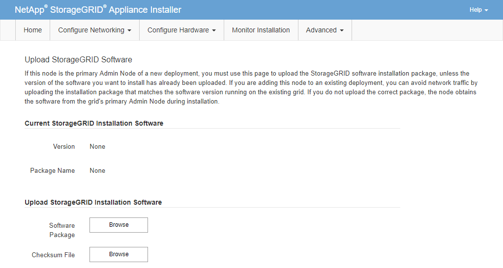

= Iniciar instalação de software no dispositivo de serviços
:allow-uri-read: 
:icons: font
:imagesdir: ../media/

[role="lead"]
Para instalar um nó de gateway ou um nó de administração em um dispositivo de serviços, use o instalador do dispositivo StorageGRID , que está incluído no dispositivo.

.Antes de começar
* O dispositivo é instalado em um rack, conectado às suas redes e ligado.
* Os links de rede e endereços IP são configurados para o dispositivo usando o StorageGRID Appliance Installer.
* Se estiver instalando um nó de gateway ou um nó de administração não primário, você saberá o endereço IP do nó de administração primário da grade StorageGRID .
* Todas as sub-redes da Rede de Grade listadas na página Configuração de IP do Instalador do Dispositivo StorageGRID são definidas na Lista de Sub-redes da Rede de Grade no Nó de Administração primário.
+
Ver https://docs.netapp.com/us-en/storagegrid-appliances/installconfig/index.html["Início rápido para instalação de hardware"^] .

* Você está usando umlink:../admin/web-browser-requirements.html["navegador da web compatível"] .
* Você tem um dos endereços IP atribuídos ao dispositivo.  Você pode usar o endereço IP da Rede de Administração, da Rede de Grade ou da Rede de Cliente.
* Se estiver instalando um nó de administração primário, você terá os arquivos de instalação do Ubuntu ou Debian para esta versão do StorageGRID disponíveis.
+

NOTE: Uma versão recente do software StorageGRID é pré-carregada no dispositivo de serviços durante a fabricação.  Se a versão pré-carregada do software corresponder à versão que está sendo usada na sua implantação do StorageGRID , você não precisará dos arquivos de instalação.

.Sobre esta tarefa
Para instalar o software StorageGRID em um dispositivo de serviços:

* Para um nó de administração primário, especifique o nome do nó e carregue os pacotes de software apropriados (se necessário).
* Para um nó de administração não primário ou um nó de gateway, especifique ou confirme o endereço IP do nó de administração primário e o nome do nó.
* Você inicia a instalação e aguarda enquanto os volumes são configurados e o software é instalado.
* No meio do processo, a instalação é pausada.  Para retomar a instalação, você deve entrar no Grid Manager e configurar o nó pendente como um substituto para o nó com falha.
* Após configurar o nó, o processo de instalação do dispositivo é concluído e o dispositivo é reinicializado.

.Passos
. Abra um navegador e insira um dos endereços IP do dispositivo de serviços.
+
`https://_Controller_IP_:8443`

+
A página inicial do instalador do dispositivo StorageGRID é exibida.

+
image::../media/services_appliance_installer_gateway_node.png[Página inicial do instalador de eletrodomésticos]

. Para instalar um nó de administração primário:
+
.. Na seção Este nó, para *Tipo de nó*, selecione *Administrador principal*.
.. No campo *Nome do nó*, insira o mesmo nome que foi usado para o nó que você está recuperando e clique em *Salvar*.
.. Na seção Instalação, verifique a versão do software listada em Estado atual
+
Se a versão do software que está pronta para instalar estiver correta, pule para a próxima etapa.<<installation_section_step,Etapa de instalação>> .

.. Se você precisar carregar uma versão diferente do software, no menu *Avançado*, selecione *Carregar software StorageGRID *.
+
A página Upload StorageGRID Software é exibida.

+

.. Clique em *Procurar* para carregar o *Pacote de software* e o *Arquivo de soma de verificação* para o software StorageGRID .
+
Os arquivos são carregados automaticamente após você selecioná-los.

.. Clique em *Início* para retornar à página inicial do instalador do dispositivo StorageGRID .

. Para instalar um nó de gateway ou um nó de administração não primário:
+
.. Na seção Este nó, para *Tipo de nó*, selecione *Gateway* ou *Administrador não primário*, dependendo do tipo de nó que você está restaurando.
.. No campo *Nome do nó*, insira o mesmo nome que foi usado para o nó que você está recuperando e clique em *Salvar*.
.. Na seção Conexão do nó de administração principal, determine se você precisa especificar o endereço IP para o nó de administração principal.
+
O instalador do dispositivo StorageGRID pode descobrir esse endereço IP automaticamente, supondo que o nó de administração primário, ou pelo menos um outro nó de grade com ADMIN_IP configurado, esteja presente na mesma sub-rede.

.. Se este endereço IP não for exibido ou você precisar alterá-lo, especifique o endereço:

+
[cols="1a,2a"]
|===
| Opção | Descrição 

 a| 
Entrada manual de IP
 a| 
.. Desmarque a caixa de seleção *Habilitar descoberta do nó de administração*.
.. Digite o endereço IP manualmente.
.. Clique em *Salvar*.
.. Aguarde enquanto o estado da conexão para o novo endereço IP se torna "pronto".

 a| 
Descoberta automática de todos os nós administrativos primários conectados
 a| 
.. Marque a caixa de seleção *Habilitar descoberta do nó de administração*.
.. Na lista de endereços IP descobertos, selecione o nó de administração principal da grade onde este dispositivo de serviços será implantado.
.. Clique em *Salvar*.
.. Aguarde enquanto o estado da conexão para o novo endereço IP se torna "pronto".

|===
. [[installation_section_step]]Na seção Instalação, confirme se o estado atual é Pronto para iniciar a instalação do nome do nó e se o botão *Iniciar instalação* está habilitado.
+
Se o botão *Iniciar instalação* não estiver habilitado, talvez seja necessário alterar a configuração de rede ou as configurações de porta.  Para obter instruções, consulte as instruções de manutenção do seu aparelho.

. Na página inicial do StorageGRID Appliance Installer, clique em *Iniciar instalação*.
+
O estado atual muda para "A instalação está em andamento" e a página Instalação do monitor é exibida.

+

NOTE: Se precisar acessar a página de instalação do monitor manualmente, clique em *Instalação do monitor* na barra de menu.

