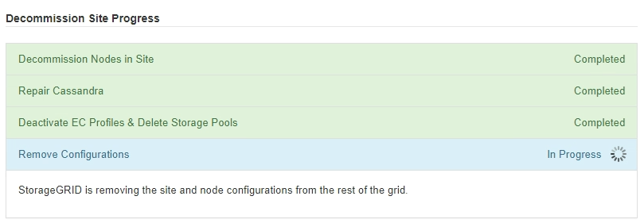

= Etapa 6: Monitorar o descomissionamento
:allow-uri-read: 
:icons: font
:imagesdir: ../media/

[role="lead"]
Na Etapa 6 (Monitorar descomissionamento) do assistente da página Descomissionar site, você pode monitorar o progresso conforme o site é removido.

.Sobre esta tarefa
Quando o StorageGRID remove um site conectado, ele remove os nós nesta ordem:

. Nós de gateway
. Nós de administração
. Nós de armazenamento

Quando o StorageGRID remove um site desconectado, ele remove os nós nesta ordem:

. Nós de gateway
. Nós de armazenamento
. Nós de administração

Cada nó de gateway ou nó de administração pode levar apenas alguns minutos ou uma hora para ser removido; no entanto, os nós de armazenamento podem levar dias ou semanas.

.Passos
. Assim que um novo Pacote de Recuperação for gerado, baixe o arquivo.
+
image::../media/decommission_site_step_6_recovery_package.png[Pacote de recuperação da etapa 6 de descomissionamento do site]

+

NOTE: Baixe o Pacote de Recuperação o mais rápido possível para garantir que você possa recuperar sua rede se algo der errado durante o procedimento de desativação.

+
.. Selecione o link na mensagem ou selecione *MANUTENÇÃO* > *Sistema* > *Pacote de recuperação*.
.. Baixe o `.zip` arquivo.
+
Veja as instruções paralink:downloading-recovery-package.html["baixando o pacote de recuperação"] .

+

NOTE: O arquivo do pacote de recuperação deve ser protegido porque contém chaves de criptografia e senhas que podem ser usadas para obter dados do sistema StorageGRID .

. Usando o gráfico de movimentação de dados, monitore a movimentação de dados de objetos deste site para outros sites.
+
A movimentação de dados começou quando você ativou a nova política de ILM na Etapa 3 (Revisar política de ILM).  A movimentação de dados ocorrerá durante todo o procedimento de desativação.

+
image::../media/decommission_site_step_6_data_movement.png[Desativação do Site Etapa 6 - Movimentação de Dados]

. Na seção Progresso do nó da página, monitore o progresso do procedimento de desativação à medida que os nós são removidos.
+
Quando um nó de armazenamento é removido, cada nó passa por uma série de estágios.  Embora a maioria dessas etapas ocorra de forma rápida ou até mesmo imperceptível, pode ser necessário esperar dias ou até semanas para que outras etapas sejam concluídas, dependendo da quantidade de dados que precisa ser movida.  É necessário tempo adicional para gerenciar dados codificados para eliminação e reavaliar o ILM.

+
image::../media/decommission_site_step_6_storage_node.png[Etapa 6 do local de descomissionamento do nó de armazenamento]

+
Se você estiver monitorando o progresso da desativação de um site conectado, consulte esta tabela para entender os estágios de desativação de um nó de armazenamento:

+
[cols="1a,2a"]
|===
| Estágio | Duração estimada 

 a| 
Pendente
 a| 
Minuto ou menos

 a| 
Espere pelas fechaduras
 a| 
Minutos

 a| 
Preparar tarefa
 a| 
Minuto ou menos

 a| 
Marcação LDR Desativada
 a| 
Minutos

 a| 
Desativação de dados replicados e codificados para eliminação
 a| 
Horas, dias ou semanas com base na quantidade de dados

*Observação*: se você precisar executar outras atividades de manutenção, poderá pausar a desativação do site durante esta etapa.

 a| 
Estado definido do LDR
 a| 
Minutos

 a| 
Filas de auditoria de descarga
 a| 
Minutos a horas, com base no número de mensagens e na latência da rede.

 a| 
Completo
 a| 
Minutos

|===
+
Se você estiver monitorando o progresso da desativação de um site desconectado, consulte esta tabela para entender os estágios de desativação de um nó de armazenamento:

+
[cols="1a,1a"]
|===
| Estágio | Duração estimada 

 a| 
Pendente
 a| 
Minuto ou menos

 a| 
Espere pelas fechaduras
 a| 
Minutos

 a| 
Preparar tarefa
 a| 
Minuto ou menos

 a| 
Desativar serviços externos
 a| 
Minutos

 a| 
Revogação de Certificado
 a| 
Minutos

 a| 
Cancelar registro do nó
 a| 
Minutos

 a| 
Cancelar registro de nível de armazenamento
 a| 
Minutos

 a| 
Remoção do Grupo de Armazenamento
 a| 
Minutos

 a| 
Remoção de Entidade
 a| 
Minutos

 a| 
Completo
 a| 
Minutos

|===
. Depois que todos os nós atingirem o estágio Concluído, aguarde a conclusão das operações restantes de desativação do site.
+
** Durante a etapa *Reparar Cassandra*, o StorageGRID faz todos os reparos necessários nos clusters Cassandra que permanecem na sua grade.  Esses reparos podem levar vários dias ou mais, dependendo de quantos nós de armazenamento restam na sua grade.
+
image::../media/decommission_site_step_6_repair_cassandra.png[Descomissionamento do local Etapa 6 Reparo Cassandra]

** Durante a etapa *Desativar perfis de EC e excluir pools de armazenamento*, as seguintes alterações no ILM são feitas:
+
*** Todos os perfis de codificação de eliminação que se referiam ao site são desativados.
*** Todos os pools de armazenamento que fazem referência ao site são excluídos.
+

NOTE: O pool de armazenamento All Storage Nodes (StorageGRID 11.6 e anteriores) também foi removido porque usa o site All Sites.

** Por fim, durante a etapa *Remover configuração*, quaisquer referências restantes ao site e seus nós são removidas do restante da grade.
+

. Quando o procedimento de desativação for concluído, a página Site de desativação mostrará uma mensagem de sucesso, e o site removido não será mais exibido.
+
image::../media/decommission_site_success_message.png[Mensagem de sucesso do site de descomissionamento]

.Depois que você terminar
Conclua estas tarefas depois de concluir o procedimento de desativação do site:

* Certifique-se de que as unidades de todos os nós de armazenamento no local desativado sejam limpas.  Use uma ferramenta ou serviço de limpeza de dados disponível comercialmente para remover dados das unidades de forma permanente e segura.
* Se o site incluir um ou mais nós de administração e o logon único (SSO) estiver habilitado para seu sistema StorageGRID , remova todos os trusts de terceiros confiáveis ​​do site dos Serviços de Federação do Active Directory (AD FS).
* Depois que os nós forem desligados automaticamente como parte do procedimento de desativação do site conectado, remova as máquinas virtuais associadas.

