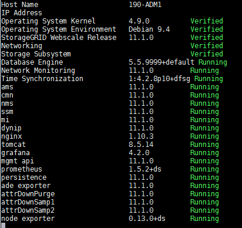

= Ver o status atual de todos os serviços
:allow-uri-read: 
:icons: font
:imagesdir: ../media/

[role="lead"]
Você pode visualizar o status atual de todos os serviços em execução em um nó de grade a qualquer momento.

.Antes de começar
Você tem o `Passwords.txt` arquivo.

.Passos
. Efetue login no nó da grade:
+
.. Digite o seguinte comando: `ssh admin@_grid_node_IP_`
.. Digite a senha listada no `Passwords.txt` arquivo.
.. Digite o seguinte comando para alternar para root: `su -`
.. Digite a senha listada no `Passwords.txt` arquivo.

+
Quando você está logado como root, o prompt muda de `$` para `#` .

. Visualize o status de todos os serviços em execução no nó da grade: `storagegrid-status`
+
Por exemplo, a saída do nó de administração primário mostra o status atual dos serviços AMS, CMN e NMS como Em execução.  Esta saída é atualizada imediatamente se o status de um serviço mudar.

+

. Retorne à linha de comando e pressione *Ctrl*+*C*.
. Opcionalmente, visualize um relatório estático para todos os serviços em execução no nó da grade: `/usr/local/servermanager/reader.rb`
+
Este relatório inclui as mesmas informações do relatório atualizado continuamente, mas não é atualizado se o status de um serviço mudar.

. Sair do shell de comando: `exit`

