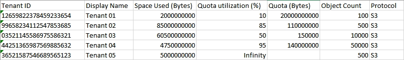

= Monitorar a atividade do inquilino
:allow-uri-read: 
:icons: font
:imagesdir: ../media/

[role="lead"]
Todas as atividades do cliente S3 estão associadas às contas de locatário do StorageGRID .  Você pode usar o Grid Manager para monitorar o uso de armazenamento ou o tráfego de rede para todos os locatários ou um locatário específico.  Você pode usar o log de auditoria ou os painéis do Grafana para coletar informações mais detalhadas sobre como os locatários estão usando o StorageGRID.

.Antes de começar
* Você está conectado ao Grid Manager usando umlink:../admin/web-browser-requirements.html["navegador da web compatível"] .
* Você tem olink:../admin/admin-group-permissions.html["Permissão de acesso root ou contas de locatário"] .

== Ver todos os inquilinos

A página Inquilinos mostra informações básicas para todas as contas de inquilinos atuais.

.Passos
. Selecione *LOCATÁRIOS*.
. Revise as informações mostradas nas páginas do Locatário.
+
O espaço lógico usado, o uso da cota, a cota e a contagem de objetos são listados para cada locatário.  Se uma cota não for definida para um locatário, os campos Uso de cota e Cota conterão um hífen (&#8212;).

+

NOTE: Os valores de espaço utilizado são estimativas. Essas estimativas são afetadas pelo tempo de ingestão, pela conectividade de rede e pelo status do nó.

+
image::../media/tenant_accounts_page.png[Página de contas de inquilinos]

. Opcionalmente, faça login em uma conta de locatário selecionando o link de loginimage:../media/icon_tenant_sign_in.png["Ícone de login do inquilino"] na coluna * Sign in/Copiar URL*.
. Opcionalmente, copie o URL da página de login de um locatário selecionando o link copiar URLimage:../media/icon_tenant_copy_url.png["Ícone de URL de cópia do locatário"] na coluna * Sign in/Copiar URL*.
. Opcionalmente, selecione *Exportar para CSV* para visualizar e exportar um `.csv` arquivo contendo os valores de uso para todos os locatários.
+
Você será solicitado a abrir ou salvar o `.csv` arquivo.

+
O conteúdo do `.csv` arquivo se parece com o exemplo a seguir:

+

+
Você pode abrir o `.csv` arquivar em um aplicativo de planilha ou usá-lo em automação.

. Se nenhum objeto estiver listado, opcionalmente, selecione *Ações* > *Excluir* para remover um ou mais inquilinos. Ver link:../admin/deleting-tenant-account.html["Excluir conta de inquilino"] .
+
Não é possível remover uma conta de locatário se ela incluir buckets ou contêineres.

== Ver um inquilino específico

Você pode visualizar detalhes de um inquilino específico.

.Passos
. Selecione o nome do inquilino na página Inquilinos.
+
A página de detalhes do inquilino é exibida.

+
image::../media/tenant_usage_modal.png[Modal de uso do inquilino]

. Revise a visão geral do inquilino no topo da página.
+
Esta seção da página de detalhes fornece informações resumidas sobre o locatário, incluindo a contagem de objetos do locatário, o uso da cota, o espaço lógico usado e a configuração da cota.

. Na aba *Detalhamento de espaço*, revise o gráfico *Consumo de espaço*.
+
Este gráfico mostra o consumo total de espaço para todos os buckets S3 do locatário.

+
Se uma cota foi definida para este locatário, a quantidade de cota usada e restante será exibida em texto (por exemplo, `85.00 GB of 100 GB used` ).  Se nenhuma cota foi definida, o locatário tem uma cota ilimitada e o texto inclui apenas uma quantidade de espaço usado (por exemplo, `85.00 GB used` ).  O gráfico de barras mostra a porcentagem de cota em cada balde ou contêiner.  Se o locatário tiver excedido a cota de armazenamento em mais de 1% e em pelo menos 1 GB, o gráfico mostrará a cota total e o valor excedente.

+
Você pode colocar o cursor sobre o gráfico de barras para ver o armazenamento usado por cada bucket ou contêiner.  Você pode colocar o cursor sobre o segmento de espaço livre para ver a quantidade de cota de armazenamento restante.

+
image::../media/tenant_bucket_space_consumption_GM.png[Gráfico de barras de consumo de balde de inquilino]

+

CAUTION: O uso da cota é baseado em estimativas internas e pode ser excedido em alguns casos.  Por exemplo, o StorageGRID verifica a cota quando um locatário começa a carregar objetos e rejeita novas ingestões se o locatário tiver excedido a cota.  No entanto, o StorageGRID não leva em consideração o tamanho do upload atual ao determinar se a cota foi excedida.  Se os objetos forem excluídos, um locatário poderá ser temporariamente impedido de carregar novos objetos até que o uso da cota seja recalculado.  Os cálculos de uso de cota podem levar 10 minutos ou mais.

+

NOTE: O uso de cota de um locatário indica a quantidade total de dados de objeto que o locatário carregou no StorageGRID (tamanho lógico).  O uso da cota não representa o espaço usado para armazenar cópias desses objetos e seus metadados (tamanho físico).

+

NOTE: Você pode habilitar a regra de alerta *Uso alto de cota de locatário* para determinar se os locatários estão consumindo suas cotas.  Se habilitado, esse alerta será acionado quando um locatário tiver usado 90% de sua cota. Para obter instruções, consultelink:../monitor/editing-alert-rules.html["Editar regras de alerta"] .

. Na aba *Detalhamento do espaço*, revise os *Detalhes do bucket*.
+
Esta tabela lista os buckets do S3 para o locatário.  O espaço usado é a quantidade total de dados de objeto no bucket ou contêiner.  Este valor não representa o espaço de armazenamento necessário para cópias do ILM e metadados de objetos.

. Opcionalmente, selecione *Exportar para CSV* para visualizar e exportar um arquivo .csv contendo os valores de uso para cada bucket ou contêiner.
+
O conteúdo de um locatário S3 individual `.csv` arquivo se parece com o exemplo a seguir:

+
image::../media/tenant_bucket_details_csv.png[Exemplo de CSV de detalhes do bucket do locatário]

+
Você pode abrir o `.csv` arquivar em um aplicativo de planilha ou usá-lo em automação.

. Opcionalmente, selecione a aba *Recursos permitidos* para ver uma lista de permissões e recursos habilitados para o locatário.  Verlink:../admin/editing-tenant-account.html["Editar conta de inquilino"] se você precisar alterar qualquer uma dessas configurações.
. Se o locatário tiver a permissão *Usar conexão de federação de grade*, selecione opcionalmente a guia *Federação de grade* para saber mais sobre a conexão.
+
Verlink:../admin/grid-federation-overview.html["O que é federação de grade?"] elink:../admin/grid-federation-manage-tenants.html["Gerenciar os inquilinos permitidos para federação de rede"] .

== Exibir tráfego de rede

Se houver políticas de classificação de tráfego em vigor para um locatário, revise o tráfego de rede desse locatário.

.Passos
. Selecione *CONFIGURAÇÃO* > *Rede* > *Classificação de tráfego*.
+
A página Políticas de Classificação de Tráfego é exibida e as políticas existentes são listadas na tabela.

. Revise a lista de políticas para identificar aquelas que se aplicam a um inquilino específico.
. Para visualizar métricas associadas a uma política, selecione o botão de opção à esquerda da política e selecione *Métricas*.
. Analise os gráficos para determinar com que frequência a política está limitando o tráfego e se você precisa ajustá-la.

Ver link:../admin/managing-traffic-classification-policies.html["Gerenciar políticas de classificação de tráfego"] para maiores informações.

== Use o log de auditoria

Opcionalmente, você pode usar o log de auditoria para um monitoramento mais granular das atividades de um locatário.

Por exemplo, você pode monitorar os seguintes tipos de informações:

* Operações específicas do cliente, como PUT, GET ou DELETE
* Tamanhos de objetos
* A regra ILM aplicada a objetos
* O IP de origem das solicitações do cliente

Os logs de auditoria são gravados em arquivos de texto que você pode analisar usando a ferramenta de análise de logs de sua escolha.  Isso permite que você entenda melhor as atividades do cliente ou implemente modelos sofisticados de cobrança e estorno.

Ver link:../audit/index.html["Revisar logs de auditoria"] para maiores informações.

== Use métricas do Prometheus

Opcionalmente, use as métricas do Prometheus para relatar a atividade do locatário.

* No Grid Manager, selecione *SUPORTE* > *Ferramentas* > *Métricas*. Você pode usar painéis existentes, como o S3 Overview, para revisar as atividades do cliente.
+

NOTE: As ferramentas disponíveis na página Métricas destinam-se principalmente ao uso do suporte técnico.  Alguns recursos e itens de menu nessas ferramentas são intencionalmente não funcionais.

* Na parte superior do Grid Manager, selecione o ícone de ajuda e selecione *Documentação da API*.  Você pode usar as métricas na seção Métricas da API de gerenciamento de grade para criar regras de alerta e painéis personalizados para a atividade do locatário.

Ver link:reviewing-support-metrics.html["Revisar métricas de suporte"] para maiores informações.
