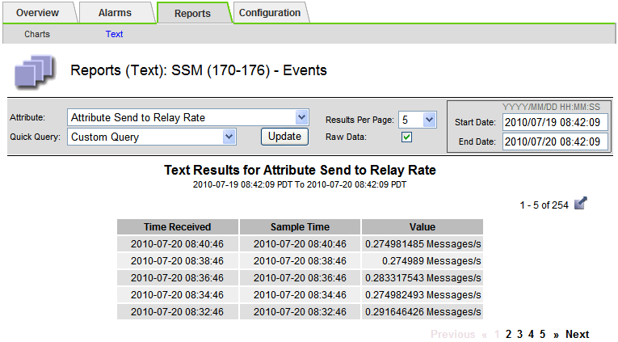

= Usar relatórios de texto
:allow-uri-read: 
:icons: font
:imagesdir: ../media/

[role="lead"]
Os relatórios de texto exibem uma representação textual dos valores de dados de atributos que foram processados pelo serviço NMS.  Há dois tipos de relatórios gerados dependendo do período de tempo em que você está relatando: relatórios de texto bruto para períodos inferiores a uma semana e relatórios de texto agregado para períodos superiores a uma semana.

== Relatórios de texto bruto

Um relatório de texto bruto exibe detalhes sobre o atributo selecionado:

* Hora de recebimento: data e hora locais em que um valor de amostra dos dados de um atributo foi processado pelo serviço NMS.
* Hora da amostra: data e hora locais em que um valor de atributo foi amostrado ou alterado na origem.
* Valor: Valor do atributo no momento da amostra.

image::../media/raw_text_report.gif[captura de tela mostrando relatório de texto bruto]

== Relatórios de texto agregado

Um relatório de texto agregado exibe dados durante um período de tempo mais longo (geralmente uma semana) do que um relatório de texto bruto.  Cada entrada é o resultado do resumo de vários valores de atributos (um agregado de valores de atributos) pelo serviço NMS ao longo do tempo em uma única entrada com valores médios, máximos e mínimos derivados da agregação.

Cada entrada exibe as seguintes informações:

* Hora agregada: última data e hora local em que o serviço NMS agregou (coletou) um conjunto de valores de atributos alterados.
* Valor médio: a média do valor do atributo ao longo do período de tempo agregado.
* Valor mínimo: o valor mínimo ao longo do período de tempo agregado.
* Valor máximo: o valor máximo durante o período de tempo agregado.

image::../media/aggregate_text_report.gif[captura de tela mostrando relatório de texto agregado]

== Gerar relatórios de texto

Os relatórios de texto exibem uma representação textual dos valores de dados de atributos que foram processados pelo serviço NMS.  Você pode gerar relatórios sobre um site de data center, nó de grade, componente ou serviço.

.Antes de começar
* Você deve estar conectado ao Grid Manager usando umlink:../admin/web-browser-requirements.html["navegador da web compatível"] .
* Você temlink:../admin/admin-group-permissions.html["permissões de acesso específicas"] .

.Sobre esta tarefa
Para dados de atributos que devem mudar continuamente, esses dados de atributos são amostrados pelo serviço NMS (na origem) em intervalos regulares.  Para dados de atributo que mudam com pouca frequência (por exemplo, dados baseados em eventos como alterações de estado ou status), um valor de atributo é enviado ao serviço NMS quando o valor muda.

O tipo de relatório exibido depende do período de tempo configurado.  Por padrão, relatórios de texto agregados são gerados para períodos maiores que uma semana.

O texto em cinza indica que o serviço estava administrativamente inativo durante o período em que foi amostrado.  O texto azul indica que o serviço estava em um estado desconhecido.

.Passos
. Selecione *SUPORTE* > *Ferramentas* > *Topologia de grade*.
. Selecione *_nó de grade_* > *_componente ou serviço_* > *Relatórios* > *Texto*.
. Selecione o atributo a ser relatado na lista suspensa *Atributo*.
. Selecione o número de resultados por página na lista suspensa *Resultados por página*.
. Para arredondar valores para um máximo de três casas decimais (por exemplo, para atributos relatados como porcentagens), desmarque a caixa de seleção *Dados Brutos*.
. Selecione o período de tempo para relatar na lista suspensa *Consulta rápida*.
+
Selecione a opção Consulta personalizada para selecionar um intervalo de tempo específico.

+
O relatório aparece depois de alguns instantes.  Reserve vários minutos para tabulação de intervalos de tempo longos.

. Se você selecionou Consulta personalizada, precisará personalizar o período de tempo do relatório inserindo a *Data de início* e a *Data de término*.
+
Use o formato `YYYY/MM/DDHH:MM:SS` no horário local.  Zeros à esquerda são necessários para corresponder ao formato.  Por exemplo, 2017/4/6 7:30:00 falha na validação.  O formato correto é: 2017/04/06 07:30:00.

. Clique em *Atualizar*.
+
Um relatório de texto é gerado após alguns instantes.  Reserve vários minutos para tabulação de intervalos de tempo longos.  Dependendo do período definido para a consulta, um relatório de texto bruto ou um relatório de texto agregado será exibido.

== Exportar relatórios de texto

Os relatórios de texto exportados abrem uma nova guia do navegador, que permite selecionar e copiar os dados.

.Sobre esta tarefa
Os dados copiados podem então ser salvos em um novo documento (por exemplo, uma planilha) e usados ​​para analisar o desempenho do sistema StorageGRID .

.Passos
. Selecione *SUPORTE* > *Ferramentas* > *Topologia de grade*.
. Crie um relatório de texto.
. Clique em *Exportar*image:../media/icon_export.gif["ícone de exportação"] .
+

+
A janela Exportar Relatório de Texto é aberta exibindo o relatório.

+
image::../media/export_text_report_data.gif[captura de tela mostrando exemplo de relatório de texto]

. Selecione e copie o conteúdo da janela Exportar Relatório de Texto.
+
Esses dados agora podem ser colados em um documento de terceiros, como uma planilha.

