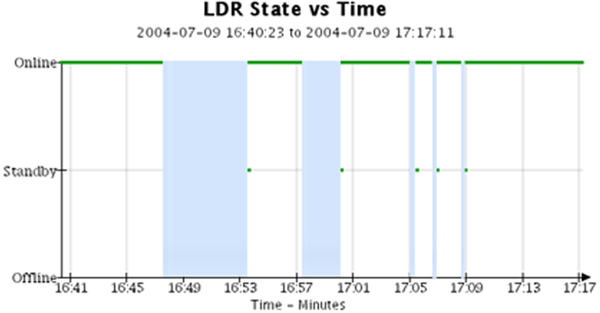
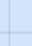

= Use tabelas e gráficos
:allow-uri-read: 
:icons: font
:imagesdir: ../media/

[role="lead"]
Você pode usar gráficos e relatórios para monitorar o estado do sistema StorageGRID e solucionar problemas.

NOTE: O Grid Manager é atualizado a cada versão e pode não corresponder às capturas de tela de exemplo nesta página.

== Tipos de gráficos

Gráficos e tabelas resumem os valores de métricas e atributos específicos do StorageGRID .

O painel do Grid Manager inclui cartões que resumem o armazenamento disponível para a grade e cada site.

image::../media/dashboard_data_and_metadata_space_usage_breakdown.png[Análise detalhada do uso do espaço de metadados e dados do painel]

O painel de uso de armazenamento no painel do Gerenciador de locatários exibe o seguinte:

* Uma lista dos maiores buckets (S3) ou contêineres (Swift) para o locatário
* Um gráfico de barras que representa os tamanhos relativos dos maiores baldes ou recipientes
* A quantidade total de espaço utilizado e, se uma cota for definida, a quantidade e a porcentagem de espaço restante

image::../media/tenant_dashboard_with_buckets.png[Painel do inquilino]

Além disso, gráficos que mostram como as métricas e os atributos do StorageGRID mudam ao longo do tempo estão disponíveis na página Nós e na página *SUPORTE* > *Ferramentas* > *Topologia de grade*.

Existem quatro tipos de gráficos:

* *Gráficos Grafana*: Exibidos na página Nós, os gráficos Grafana são usados para plotar os valores das métricas do Prometheus ao longo do tempo.  Por exemplo, a guia *NÓS* > *Rede* para um Nó de Armazenamento inclui um gráfico Grafana para tráfego de rede.
+
image::../media/nodes_page_network_tab.png[Página de nós Guia Rede]

+

NOTE: Os gráficos do Grafana também estão incluídos nos painéis pré-construídos disponíveis na página *SUPORTE* > *Ferramentas* > *Métricas*.

* *Gráficos de linha*: Disponíveis na página Nós e na página *SUPORTE* > *Ferramentas* > *Topologia de grade* (selecione o ícone do gráficoimage:../media/icon_chart_new_for_11_5.png["Gráfico de ícones (novo)"] após um valor de dados), gráficos de linha são usados ​​para plotar os valores dos atributos StorageGRID que têm um valor unitário (como deslocamento de frequência NTP, em ppm).  As alterações no valor são plotadas em intervalos de dados regulares (bins) ao longo do tempo.
+
image::../media/line_graph.gif[Gráfico de linha]

* *Gráficos de área*: Disponíveis na página Nós e na página *SUPORTE* > *Ferramentas* > *Topologia de grade* (selecione o ícone do gráficoimage:../media/icon_chart_new_for_11_5.png["Gráfico de ícones (novo)"] após um valor de dados), gráficos de área são usados para plotar quantidades de atributos volumétricos, como contagens de objetos ou valores de carga de serviço.  Os gráficos de área são semelhantes aos gráficos de linhas, mas incluem um sombreamento marrom claro abaixo da linha.  As alterações no valor são plotadas em intervalos de dados regulares (bins) ao longo do tempo.
+
image::../media/area_graph.gif[Gráfico de área]

* Alguns gráficos são indicados com um tipo diferente de ícone de gráficoimage:../media/icon_chart_new_for_11_5.png["Ícone do gráfico"] e têm um formato diferente:
+
image::../media/charts_lost_object_detected.png[Gráficos Objeto Perdido Detectado]

* *Gráfico de estado*: Disponível na página *SUPORTE* > *Ferramentas* > *Topologia de grade* (selecione o ícone do gráficoimage:../media/icon_chart_new_for_11_5.png["Gráfico de ícones (novo)"] após um valor de dados), os gráficos de estado são usados para plotar valores de atributos que representam estados distintos, como um estado de serviço que pode ser online, em espera ou offline.  Os gráficos de estado são semelhantes aos gráficos de linha, mas a transição é descontínua; ou seja, o valor salta de um valor de estado para outro.
+

.Informações relacionadas
* link:viewing-nodes-page.html["Ver a página de nós"]
* link:viewing-grid-topology-tree.html["Visualizar a árvore de topologia da grade"]
* link:reviewing-support-metrics.html["Revisar métricas de suporte"]

== Legenda do gráfico

As linhas e cores usadas para desenhar gráficos têm um significado específico.

[cols="1a,3a"]
|===
| Exemplo | Significado 

 a| 
image:../media/dark_green_chart_line.gif["captura de tela mostrando linha verde escura"]
 a| 
Os valores de atributos relatados são plotados usando linhas verde-escuras.

 a| 
image:../media/light_green_chart_line.gif["captura de tela mostrando sombreamento que indica agrupamento de dados"]
 a| 
O sombreamento verde claro ao redor das linhas verde escuro indica que os valores reais nesse intervalo de tempo variam e foram "agrupados" para uma plotagem mais rápida.  A linha escura representa a média ponderada.  O intervalo em verde claro indica os valores máximo e mínimo dentro do compartimento.  O sombreamento marrom claro é usado em gráficos de área para indicar dados volumétricos.

 a| 
image:../media/no_data_plotted_chart.gif["captura de tela mostrando áreas em branco na linha do gráfico"]
 a| 
Áreas em branco (sem dados plotados) indicam que os valores dos atributos não estavam disponíveis.  O fundo pode ser azul, cinza ou uma mistura de cinza e azul, dependendo do estado do serviço que relata o atributo.

 a| 

 a| 
O sombreamento azul claro indica que alguns ou todos os valores de atributo naquele momento eram indeterminados; o atributo não estava relatando valores porque o serviço estava em um estado desconhecido.

 a| 
image:../media/gray_chart_shading.gif["captura de tela mostrando sombreamento cinza devido a valores desconhecidos"]
 a| 
O sombreamento cinza indica que alguns ou todos os valores de atributos naquele momento não eram conhecidos porque o serviço que relatava os atributos estava administrativamente inativo.

 a| 
image:../media/gray_blue_chart_shading.gif["captura de tela mostrando uma mistura de valores indeterminados e desconhecidos"]
 a| 
Uma mistura de sombreamento cinza e azul indica que alguns dos valores de atributos no momento eram indeterminados (porque o serviço estava em um estado desconhecido), enquanto outros não eram conhecidos porque o serviço que relatava os atributos estava administrativamente inativo.

|===

== Exibir tabelas e gráficos

A página Nós contém os gráficos e tabelas que você deve acessar regularmente para monitorar atributos como capacidade de armazenamento e taxa de transferência.  Em alguns casos, especialmente ao trabalhar com suporte técnico, você pode usar a página *SUPORTE* > *Ferramentas* > *Topologia de grade* para acessar gráficos adicionais.

.Antes de começar
Você deve estar conectado ao Grid Manager usando umlink:../admin/web-browser-requirements.html["navegador da web compatível"] .

.Passos
. Selecione *NODES*. Em seguida, selecione um nó, um site ou a grade inteira.
. Selecione a aba cujas informações você deseja visualizar.
+
Algumas guias incluem um ou mais gráficos Grafana, que são usados para plotar os valores das métricas do Prometheus ao longo do tempo.  Por exemplo, a guia *NÓS* > *Hardware* para um nó inclui dois gráficos Grafana.

+
image::../media/nodes_page_hardware_tab_graphs.png[Gráficos de guias de hardware de página de nós]

. Opcionalmente, posicione o cursor sobre o gráfico para ver valores mais detalhados de um determinado momento.
+
image::../media/nodes_page_memory_usage_details.png[Detalhes de uso de memória da página de nós]

. Conforme necessário, muitas vezes você pode exibir um gráfico para um atributo ou métrica específica.  Na tabela na página Nós, selecione o ícone do gráficoimage:../media/icon_chart_new_for_11_5.png["Ícone do gráfico"] à direita do nome do atributo.
+

NOTE: Os gráficos não estão disponíveis para todas as métricas e atributos.

+
*Exemplo 1*: Na guia Objetos de um Nó de Armazenamento, você pode selecionar o ícone do gráficoimage:../media/icon_chart_new_for_11_5.png["Ícone do gráfico"] para ver o número total de consultas bem-sucedidas do repositório de metadados para o nó de armazenamento.

+
image::../media/nodes_page_objects_successful_metadata_queries.png[Consultas de metadados bem-sucedidas]

+
image::../media/nodes_page-objects_chart_successful_metadata_queries.png[Gráficos de consultas de metadados bem-sucedidas]

+
*Exemplo 2*: Na guia Objetos de um nó de armazenamento, você pode selecionar o ícone do gráficoimage:../media/icon_chart_new_for_11_5.png["Ícone do gráfico"] para ver o gráfico Grafana da contagem de objetos perdidos detectados ao longo do tempo.

+
image::../media/object_count_table.png[Tabela de contagem de objetos]

+
image::../media/charts_lost_object_detected.png[Gráficos Objeto Perdido Detectado]

. Para exibir gráficos para atributos que não são mostrados na página Nó, selecione *SUPORTE* > *Ferramentas* > *Topologia de grade*.
. Selecione *_nó de grade_* > *_componente ou serviço_* > *Visão geral* > *Principal*.
+
image::../media/nms_chart.gif[captura de tela descrita pelo texto ao redor]

. Selecione o ícone do gráficoimage:../media/icon_chart_new_for_11_5.png["Ícone do gráfico"] ao lado do atributo.
+
A exibição muda automaticamente para a página *Relatórios* > *Gráficos*.  O gráfico exibe os dados do atributo no último dia.

== Gerar gráficos

Os gráficos exibem uma representação gráfica dos valores de dados de atributos.  Você pode gerar relatórios sobre um site de data center, nó de grade, componente ou serviço.

.Antes de começar
* Você deve estar conectado ao Grid Manager usando umlink:../admin/web-browser-requirements.html["navegador da web compatível"] .
* Você temlink:../admin/admin-group-permissions.html["permissões de acesso específicas"] .

.Passos
. Selecione *SUPORTE* > *Ferramentas* > *Topologia de grade*.
. Selecione *_grid node_* > *_component or service_* > *Relatórios* > *Gráficos*.
. Selecione o atributo a ser relatado na lista suspensa *Atributo*.
. Para forçar o eixo Y a começar em zero, desmarque a caixa de seleção *Escala vertical*.
. Para mostrar valores com precisão total, marque a caixa de seleção *Dados Brutos* ou, para arredondar os valores para um máximo de três casas decimais (por exemplo, para atributos relatados como porcentagens), desmarque a caixa de seleção *Dados Brutos*.
. Selecione o período de tempo para relatar na lista suspensa *Consulta rápida*.
+
Selecione a opção Consulta personalizada para selecionar um intervalo de tempo específico.

+
O gráfico aparece depois de alguns instantes.  Reserve vários minutos para tabulação de intervalos de tempo longos.

. Se você selecionou Consulta personalizada, personalize o período do gráfico inserindo a *Data de início* e a *Data de término*.
+
Use o formato `_YYYY/MM/DDHH:MM:SS_` no horário local.  Zeros à esquerda são necessários para corresponder ao formato.  Por exemplo, 2017/4/6 7:30:00 falha na validação.  O formato correto é: 2017/04/06 07:30:00.

. Selecione *Atualizar*.
+
Um gráfico é gerado após alguns segundos.  Reserve vários minutos para tabulação de intervalos de tempo longos.  Dependendo do período definido para a consulta, um relatório de texto bruto ou um relatório de texto agregado será exibido.

