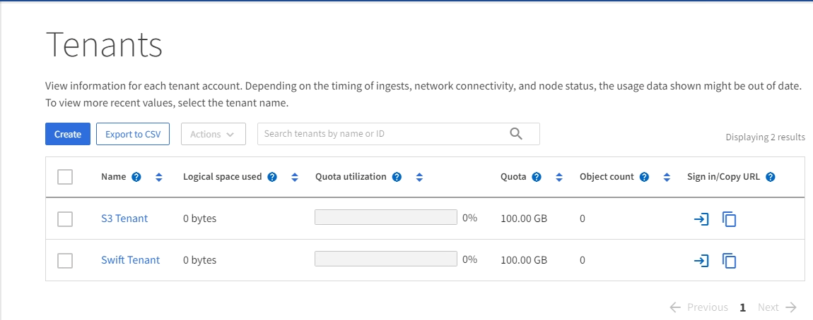

= Explore o Grid Manager
:allow-uri-read: 
:icons: font
:imagesdir: ../media/

[role="lead"]
O Grid Manager é a interface gráfica baseada em navegador que permite configurar, gerenciar e monitorar seu sistema StorageGRID .

NOTE: O Grid Manager é atualizado a cada versão e pode não corresponder às capturas de tela de exemplo nesta página.

Ao fazer login no Grid Manager, você está se conectando a um nó de administração.  Cada sistema StorageGRID inclui um nó administrativo primário e qualquer número de nós administrativos não primários. Você pode se conectar a qualquer nó administrativo, e cada nó administrativo exibe uma visão semelhante do sistema StorageGRID .

Você pode acessar o Grid Manager usando umlink:../admin/web-browser-requirements.html["navegador da web compatível"] .

== Painel do Grid Manager

Ao fazer login pela primeira vez no Grid Manager, você pode usar o painel paralink:../monitor/viewing-dashboard.html["monitorar atividades do sistema"] num relance.

O painel contém informações sobre a integridade e o desempenho do sistema, uso de armazenamento, processos do ILM, operações do S3 e os nós na grade.  Você podelink:../monitor/viewing-dashboard.html["configurar o painel"] selecionando entre uma coleção de cartões que contêm as informações necessárias para monitorar seu sistema de forma eficaz.

image::../media/grid_manager_dashboard_and_menu.png[Painel no Grid Manager]

Para obter uma explicação das informações mostradas em cada cartão, selecione o ícone de ajudaimage:../media/icon_nms_question.png["ícone de ponto de interrogação"] para esse cartão.

== Campo de pesquisa

O campo *Pesquisar* na barra de cabeçalho permite que você navegue rapidamente para uma página específica no Grid Manager.  Por exemplo, você pode digitar *km* para acessar a página do servidor de gerenciamento de chaves (KMS).

Você pode usar *Pesquisar* para encontrar entradas na barra lateral do Grid Manager e nos menus Configuração, Manutenção e Suporte.  Você também pode pesquisar por nome itens como nós de grade e contas de locatários.

== Menu de ajuda

O menu de ajudaimage:../media/icon-help-menu-bar.png["ícone de ajuda na barra de menu"] fornece acesso a:

* Olink:../fabricpool/use-fabricpool-setup-wizard.html["FabricPool"] elink:../admin/use-s3-setup-wizard.html["Configuração do S3"] mago
* O centro de documentação do StorageGRID para a versão atual
* link:../admin/using-grid-management-api.html["Documentação do API"]
* Informações sobre qual versão do StorageGRID está instalada atualmente

== Menu de alertas

O menu Alertas fornece uma interface fácil de usar para detectar, avaliar e resolver problemas que podem ocorrer durante a operação do StorageGRID .

No menu Alertas, você pode fazer o seguinte paralink:../monitor/managing-alerts.html["gerenciar alertas"] :

* Revisar alertas atuais
* Revisar alertas resolvidos
* Configurar silêncios para suprimir notificações de alerta
* Definir regras de alerta para condições que acionam alertas
* Configurar o servidor de e-mail para notificações de alerta

== Página de nós

Olink:../monitor/viewing-nodes-page.html["Página de nós"] exibe informações sobre toda a grade, cada site na grade e cada nó em um site.

A página inicial dos Nós exibe métricas combinadas para toda a grade. Para visualizar informações de um site ou nó específico, selecione o site ou nó.

image::../media/nodes_page.png[página principal dos nós]

== Página de inquilinos

Olink:../admin/managing-tenants.html["Página de inquilinos"] permite que vocêlink:../tenant/index.html["criar e monitorar as contas de locatários de armazenamento"] para seu sistema StorageGRID .  Você deve criar pelo menos uma conta de locatário para especificar quem pode armazenar e recuperar objetos e qual funcionalidade está disponível para eles.

A página Locatários também fornece detalhes de uso para cada locatário, incluindo a quantidade de armazenamento usada e o número de objetos.  Se você definir uma cota ao criar o locatário, poderá ver quanto dessa cota foi usado.

== Menu ILM

Olink:using-information-lifecycle-management.html["Menu ILM"] permite que vocêlink:../ilm/index.html["configurar as regras e políticas de gerenciamento do ciclo de vida da informação (ILM)"] que regem a durabilidade e a disponibilidade dos dados.  Você também pode inserir um identificador de objeto para visualizar os metadados desse objeto.

No menu ILM, você pode visualizar e gerenciar o ILM:

* Regras
* Políticas
* Tags de política
* Pools de armazenamento
* Graus de armazenamento
* Regiões
* Pesquisa de metadados de objetos

== Menu de configuração

O menu Configuração permite que você especifique configurações de rede, configurações de segurança, configurações do sistema, opções de monitoramento e opções de controle de acesso.

=== Tarefas de rede

As tarefas de rede incluem:

* link:../admin/managing-high-availability-groups.html["Gerenciando grupos de alta disponibilidade"]
* link:../admin/managing-load-balancing.html["Gerenciando endpoints do balanceador de carga"]
* link:../admin/configuring-s3-api-endpoint-domain-names.html["Configurando nomes de domínio de endpoint S3"]
* link:../admin/managing-traffic-classification-policies.html["Gerenciando políticas de classificação de tráfego"]
* link:../admin/configure-vlan-interfaces.html["Configurando interfaces VLAN"]

=== Tarefas de segurança

As tarefas de segurança incluem:

* link:../admin/using-storagegrid-security-certificates.html["Gerenciando certificados de segurança"]
* link:../admin/manage-firewall-controls.html["Gerenciando controles internos de firewall"]
* link:../admin/kms-configuring.html["Configurando servidores de gerenciamento de chaves"]
* Configurar as definições de segurança, incluindolink:../admin/manage-tls-ssh-policy.html["Política de TLS e SSH"] ,link:../admin/changing-network-options-object-encryption.html["opções de segurança de rede e objeto"] , elink:../admin/changing-browser-session-timeout-interface.html["configurações de segurança da interface"] .
* Configurando as configurações para umlink:../admin/configuring-storage-proxy-settings.html["proxy de armazenamento"] ou umlink:../admin/configuring-admin-proxy-settings.html["proxy de administrador"]

=== Tarefas do sistema

As tarefas do sistema incluem:

* Usandolink:../admin/grid-federation-overview.html["federação de grade"] para clonar informações de conta de locatário e replicar dados de objeto entre dois sistemas StorageGRID .
* Opcionalmente, habilitando olink:../admin/configuring-stored-object-compression.html["Compactar objetos armazenados"] opção.
* link:../ilm/managing-objects-with-s3-object-lock.html["Gerenciando bloqueio de objeto S3"]
* Compreendendo opções de armazenamento, comolink:../admin/what-object-segmentation-is.html["segmentação de objetos"] elink:../admin/what-storage-volume-watermarks-are.html["marcas d'água de volume de armazenamento"] .
* link:../ilm/manage-erasure-coding-profiles.html["Gerenciar perfis de codificação de eliminação"] .

=== Tarefas de monitoramento

As tarefas de monitoramento incluem:

* link:../monitor/configure-audit-messages.html["Configurando mensagens de auditoria e destinos de log"]
* link:../monitor/using-snmp-monitoring.html["Usando monitoramento SNMP"]

=== Tarefas de controle de acesso

As tarefas de controle de acesso incluem:

* link:../admin/managing-admin-groups.html["Gerenciando grupos de administradores"]
* link:../admin/managing-users.html["Gerenciando usuários administradores"]
* Mudando olink:../admin/changing-provisioning-passphrase.html["senha de provisionamento"] oulink:../admin/change-node-console-password.html["senhas do console do nó"]
* link:../admin/using-identity-federation.html["Usando federação de identidade"]
* link:../admin/configuring-sso.html["Configurando SSO"]

== Menu de manutenção

O menu Manutenção permite que você execute tarefas de manutenção, manutenção do sistema e manutenção da rede.

=== Tarefas

As tarefas de manutenção incluem:

* link:../maintain/decommission-procedure.html["Operações de descomissionamento"]para remover nós e sites de grade não utilizados
* link:../expand/index.html["Operações de expansão"]para adicionar novos nós e sites de grade
* link:../maintain/warnings-and-considerations-for-grid-node-recovery.html["Procedimentos de recuperação de nós de grade"]para substituir um nó com falha e restaurar dados
* link:../maintain/rename-grid-site-node-overview.html["Procedimentos de renomeação"]para alterar os nomes de exibição da sua grade, sites e nós
* link:../troubleshoot/verifying-object-integrity.html["Operações de verificação de existência de objetos"]para verificar a existência (embora não a exatidão) dos dados do objeto
* Executando umlink:../maintain/rolling-reboot-procedure.html["reinicialização contínua"] para reiniciar vários nós de grade
* link:../maintain/restoring-volume.html["Operações de restauração de volume"]

=== Sistema

As tarefas de manutenção do sistema que você pode executar incluem:

* link:../admin/viewing-storagegrid-license-information.html["Visualizando informações da licença do StorageGRID"]oulink:../admin/updating-storagegrid-license-information.html["atualizando informações de licença"]
* Gerando e baixando olink:../maintain/downloading-recovery-package.html["Pacote de Recuperação"]
* Executar atualizações de software do StorageGRID , incluindo upgrades de software, hotfixes e atualizações do software SANtricity OS em dispositivos selecionados
+
** link:../upgrade/index.html["Procedimento de atualização"]
** link:../maintain/storagegrid-hotfix-procedure.html["Procedimento de correção"]
** https://docs.netapp.com/us-en/storagegrid-appliances/sg6000/upgrading-santricity-os-on-storage-controllers-using-grid-manager-sg6000.html["Atualizar o SANtricity OS nos controladores de armazenamento SG6000 usando o Grid Manager"^]
** https://docs.netapp.com/us-en/storagegrid-appliances/sg5700/upgrading-santricity-os-on-storage-controllers-using-grid-manager-sg5700.html["Atualizar o SANtricity OS nos controladores de armazenamento SG5700 usando o Grid Manager"^]

=== Rede

As tarefas de manutenção de rede que você pode executar incluem:

* link:../maintain/configuring-dns-servers.html["Configurando servidores DNS"]
* link:../maintain/updating-subnets-for-grid-network.html["Atualizando sub-redes da rede de grade"]
* link:../maintain/configuring-ntp-servers.html["Gerenciando servidores NTP"]

== Menu de suporte

O menu Suporte fornece opções que ajudam o suporte técnico a analisar e solucionar problemas do seu sistema.

=== Ferramentas

Na seção Ferramentas do menu Suporte, você pode:

* link:../admin/configure-autosupport-grid-manager.html["Configurar AutoSupport"]
* link:../monitor/running-diagnostics.html["Executar diagnósticos"]sobre o estado atual da rede
* link:../monitor/viewing-grid-topology-tree.html["Acesse a árvore de topologia da grade"]para visualizar informações detalhadas sobre nós de grade, serviços e atributos
* link:../monitor/collecting-log-files-and-system-data.html["Coletar arquivos de log e dados do sistema"]
* link:../monitor/reviewing-support-metrics.html["Revisar métricas de suporte"]
+

NOTE: As ferramentas disponíveis na opção *Métricas* destinam-se ao uso pelo suporte técnico.  Alguns recursos e itens de menu nessas ferramentas são intencionalmente não funcionais.

=== Alarmes (legado)

As informações sobre alarmes legados foram removidas desta versão da documentação. Consulte https://docs.netapp.com/us-en/storagegrid-118/monitor/managing-alerts-and-alarms.html["Gerenciar alertas e alarmes (documentação do StorageGRID 11.8)"^] .

=== Outro

Na seção Outros do menu Suporte, você pode:

* Gerenciarlink:../admin/manage-link-costs.html["custo do link"]
* Visualizarlink:../admin/viewing-notification-status-and-queues.html["Sistema de Gerenciamento de Rede (NMS)"] entradas
* Gerenciarlink:../admin/what-storage-volume-watermarks-are.html["marcas d'água de armazenamento"]

