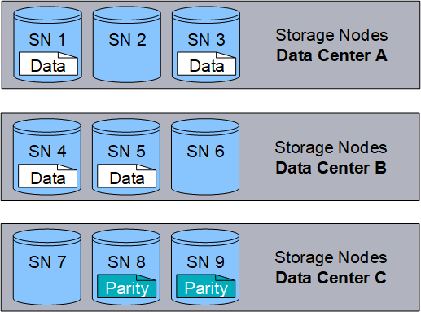

= O que é um objeto
:allow-uri-read: 
:icons: font
:imagesdir: ../media/

[role="lead"]
Com o armazenamento de objetos, a unidade de armazenamento é um objeto, em vez de um arquivo ou um bloco.  Diferentemente da hierarquia em forma de árvore de um sistema de arquivos ou armazenamento em bloco, o armazenamento de objetos organiza os dados em um layout simples e não estruturado.

O armazenamento de objetos separa a localização física dos dados do método usado para armazenar e recuperar esses dados.

Cada objeto em um sistema de armazenamento baseado em objetos tem duas partes: dados do objeto e metadados do objeto.

image::../media/object_conceptual_drawing.png[Objeto]

== O que são dados de objeto?

Dados de objetos podem ser qualquer coisa; por exemplo, uma fotografia, um filme ou um registro médico.

== O que são metadados de objeto?

Metadados de objeto são quaisquer informações que descrevem um objeto.  O StorageGRID usa metadados de objetos para rastrear os locais de todos os objetos na grade e gerenciar o ciclo de vida de cada objeto ao longo do tempo.

Os metadados do objeto incluem informações como as seguintes:

* Metadados do sistema, incluindo um ID exclusivo para cada objeto (UUID), o nome do objeto, o nome do bucket S3 ou contêiner Swift, o nome ou ID da conta do locatário, o tamanho lógico do objeto, a data e a hora em que o objeto foi criado pela primeira vez e a data e a hora em que o objeto foi modificado pela última vez.
* O local de armazenamento atual de cada cópia de objeto ou fragmento codificado para eliminação.
* Quaisquer metadados do usuário associados ao objeto.

Os metadados do objeto são personalizáveis e expansíveis, tornando-os flexíveis para uso por aplicativos.

Para obter informações detalhadas sobre como e onde o StorageGRID armazena metadados de objetos, acesselink:../admin/managing-object-metadata-storage.html["Gerenciar armazenamento de metadados de objetos"] .

== Como os dados do objeto são protegidos?

O sistema StorageGRID fornece dois mecanismos para proteger dados de objetos contra perda: replicação e codificação de eliminação.

=== Replicação

Quando o StorageGRID corresponde objetos a uma regra de gerenciamento do ciclo de vida das informações (ILM) configurada para criar cópias replicadas, o sistema cria cópias exatas dos dados do objeto e as armazena em nós de armazenamento ou pools de armazenamento em nuvem.  As regras do ILM determinam o número de cópias feitas, onde essas cópias são armazenadas e por quanto tempo elas são retidas pelo sistema.  Se uma cópia for perdida, por exemplo, como resultado da perda de um nó de armazenamento, o objeto ainda estará disponível se houver uma cópia dele em outro lugar no sistema StorageGRID .

No exemplo a seguir, a regra Fazer 2 cópias especifica que duas cópias replicadas de cada objeto sejam colocadas em um pool de armazenamento que contém três nós de armazenamento.

image::../media/ilm_replication_make_2_copies.png[Regra de fazer 2 cópias]

=== Codificação de apagamento

Quando o StorageGRID corresponde objetos a uma regra ILM configurada para criar cópias codificadas para eliminação, ele divide os dados do objeto em fragmentos de dados, calcula fragmentos de paridade adicionais e armazena cada fragmento em um nó de armazenamento diferente.  Quando um objeto é acessado, ele é remontado usando os fragmentos armazenados.  Se um dado ou um fragmento de paridade for corrompido ou perdido, o algoritmo de codificação de eliminação pode recriar esse fragmento usando um subconjunto dos dados e fragmentos de paridade restantes.  As regras do ILM e os perfis de codificação de eliminação determinam o esquema de codificação de eliminação usado.

O exemplo a seguir ilustra o uso da codificação de eliminação nos dados de um objeto.  Neste exemplo, a regra ILM usa um esquema de codificação de eliminação 4+2.  Cada objeto é dividido em quatro fragmentos de dados iguais, e dois fragmentos de paridade são computados a partir dos dados do objeto.  Cada um dos seis fragmentos é armazenado em um nó de armazenamento diferente em três data centers para fornecer proteção de dados em caso de falhas de nó ou perda de site.

.Informações relacionadas
* link:../ilm/index.html["Gerenciar objetos com ILM"]
* link:using-information-lifecycle-management.html["Use o gerenciamento do ciclo de vida da informação"]

