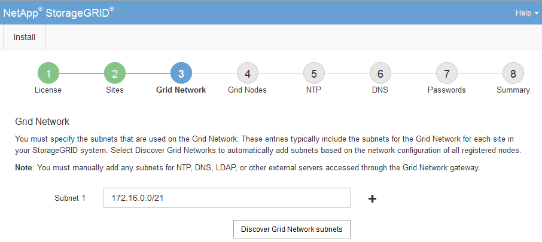

= Especificar sub-redes da rede de grade
:allow-uri-read: 
:icons: font
:imagesdir: ../media/

[role="lead"]
Você deve especificar as sub-redes que são usadas na Grid Network.

.Sobre esta tarefa
As entradas de sub-rede incluem as sub-redes da Grid Network para cada site no seu sistema StorageGRID , juntamente com quaisquer sub-redes que precisam ser acessadas por meio da Grid Network.

Se você tiver várias sub-redes de grade, o gateway da Rede de Grade será necessário.  Todas as sub-redes de grade especificadas devem ser acessíveis por meio deste gateway.

.Passos
. Especifique o endereço de rede CIDR para pelo menos uma rede de grade na caixa de texto *Sub-rede 1*.
. Clique no sinal de mais ao lado da última entrada para adicionar uma entrada de rede adicional.  Você deve especificar todas as sub-redes para todos os sites na Grid Network.
+
** Se você já tiver implantado pelo menos um nó, clique em *Descobrir sub-redes de redes de grade* para preencher automaticamente a Lista de sub-redes de redes de grade com as sub-redes relatadas pelos nós de grade que foram registrados no Gerenciador de grade.
** Você deve adicionar manualmente quaisquer sub-redes para NTP, DNS, LDAP ou outros servidores externos acessados pelo gateway da Grid Network.
+

. Clique em *Avançar*.

