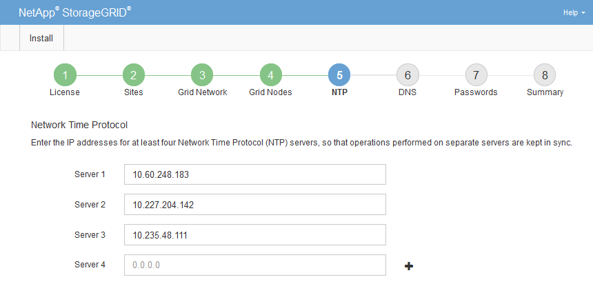

= Especificar informações do servidor Network Time Protocol
:allow-uri-read: 
:icons: font
:imagesdir: ../media/

[role="lead"]
Você deve especificar as informações de configuração do Network Time Protocol (NTP) para o sistema StorageGRID , para que as operações executadas em servidores separados possam ser mantidas sincronizadas.

.Sobre esta tarefa
Você deve especificar endereços IPv4 para os servidores NTP.

Você deve especificar servidores NTP externos.  Os servidores NTP especificados devem usar o protocolo NTP.

Você deve especificar quatro referências de servidor NTP do Stratum 3 ou superior para evitar problemas com desvio de tempo.

[NOTE]
====
Ao especificar a origem NTP externa para uma instalação do StorageGRID em nível de produção, não use o serviço Windows Time (W32Time) em uma versão do Windows anterior ao Windows Server 2016.  O serviço de tempo em versões anteriores do Windows não é suficientemente preciso e não é suportado pela Microsoft para uso em ambientes de alta precisão, como o StorageGRID.

https://support.microsoft.com/en-us/help/939322/support-boundary-to-configure-the-windows-time-service-for-high-accura["Limite de suporte para configurar o serviço Windows Time para ambientes de alta precisão"^]

====
Os servidores NTP externos são usados pelos nós aos quais você atribuiu anteriormente funções NTP primárias.

NOTE: Certifique-se de que pelo menos dois nós em cada site possam acessar pelo menos quatro fontes NTP externas.  Se apenas um nó em um site puder alcançar as fontes NTP, ocorrerão problemas de tempo se esse nó ficar inativo.  Além disso, designar dois nós por site como fontes primárias de NTP garante um tempo preciso se um site estiver isolado do restante da rede.

.Passos
. Especifique os endereços IPv4 para pelo menos quatro servidores NTP nas caixas de texto *Servidor 1* a *Servidor 4*.
. Se necessário, selecione o sinal de mais ao lado da última entrada para adicionar entradas de servidor adicionais.
+

. Selecione *Avançar*.

