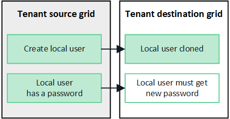
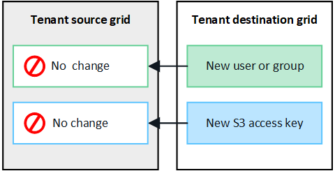

= Clonar grupos de locatários e usuários
:allow-uri-read: 
:icons: font
:imagesdir: ../media/

[role="lead"]
Se um locatário foi criado ou editado para usar uma conexão de federação de grade, esse locatário é replicado de um sistema StorageGRID (o locatário de origem) para outro sistema StorageGRID (o locatário de réplica).  Após o locatário ser replicado, todos os grupos e usuários adicionados ao locatário de origem são clonados no locatário de réplica.

O sistema StorageGRID onde o locatário é criado originalmente é a _grade de origem_ do locatário.  O sistema StorageGRID onde o locatário é replicado é a _grade de destino_ do locatário.  Ambas as contas de locatário têm o mesmo ID de conta, nome, descrição, cota de armazenamento e permissões atribuídas, mas o locatário de destino não tem inicialmente uma senha de usuário raiz.  Para mais detalhes, vejalink:../admin/grid-federation-what-is-account-clone.html["O que é clone de conta"] elink:../admin/grid-federation-manage-tenants.html["Gerenciar inquilinos permitidos"] .

A clonagem das informações da conta do locatário é necessária paralink:../admin/grid-federation-what-is-cross-grid-replication.html["replicação entre grades"] de objetos de balde.  Ter os mesmos grupos de locatários e usuários em ambas as grades garante que você possa acessar os buckets e objetos correspondentes em qualquer uma das grades.

== Fluxo de trabalho do locatário para clonagem de conta

Se sua conta de locatário tiver a permissão *Usar conexão de federação de grade*, revise o diagrama de fluxo de trabalho para ver as etapas que você executará para clonar grupos, usuários e chaves de acesso do S3.

image::../media/grid-federation-account-clone-workflow-tm.png[fluxo de trabalho do locatário para clonagem de conta.  As etapas são descritas no texto a seguir.]

Estas são as principais etapas do fluxo de trabalho:

.image:https://raw.githubusercontent.com/NetAppDocs/common/main/media/number-1.png["Um"]Sign in como inquilino
[role="quick-margin-para"]
Sign in na conta do locatário na grade de origem (a grade onde o locatário foi criado inicialmente).

.image:https://raw.githubusercontent.com/NetAppDocs/common/main/media/number-2.png["Dois"]Opcionalmente, configure a federação de identidade
[role="quick-margin-para"]
Se sua conta de locatário tiver a permissão *Usar fonte de identidade própria* para usar grupos e usuários federados, configure a mesma fonte de identidade (com as mesmas configurações) para as contas de locatário de origem e de destino.  Grupos e usuários federados não podem ser clonados, a menos que ambas as grades estejam usando a mesma fonte de identidade. Para obter instruções, consultelink:using-identity-federation.html["Usar federação de identidade"] .

.image:https://raw.githubusercontent.com/NetAppDocs/common/main/media/number-3.png["Três"]Criar grupos e usuários
[role="quick-margin-para"]
Ao criar grupos e usuários, sempre comece pela grade de origem do locatário.  Quando você adiciona um novo grupo, o StorageGRID o clona automaticamente na grade de destino.

[role="quick-margin-list"]
* Se a federação de identidade estiver configurada para todo o sistema StorageGRID ou para sua conta de locatário,link:creating-groups-for-s3-tenant.html["criar novos grupos de inquilinos"] importando grupos federados da fonte de identidade.

[role="quick-margin-list"]
* Se você não estiver usando federação de identidade,link:creating-groups-for-s3-tenant.html["criar novos grupos locais"] e entãolink:managing-local-users.html["criar usuários locais"] .

.image:https://raw.githubusercontent.com/NetAppDocs/common/main/media/number-4.png["Quatro"]Criar chaves de acesso S3
[role="quick-margin-para"]
Você podelink:creating-your-own-s3-access-keys.html["crie suas próprias chaves de acesso"] ou paralink:creating-another-users-s3-access-keys.html["criar chaves de acesso de outro usuário"] na grade de origem ou na grade de destino para acessar os buckets nessa grade.

.image:https://raw.githubusercontent.com/NetAppDocs/common/main/media/number-5.png["Cinco"]Opcionalmente, clone as chaves de acesso S3
[role="quick-margin-para"]
Se você precisar acessar buckets com as mesmas chaves de acesso em ambas as grades, crie as chaves de acesso na grade de origem e use a API do Tenant Manager para cloná-las manualmente na grade de destino. Para obter instruções, consultelink:../tenant/grid-federation-clone-keys-with-api.html["Clonar chaves de acesso S3 usando a API"] .

== Como grupos, usuários e chaves de acesso do S3 são clonados?

Revise esta seção para entender como grupos, usuários e chaves de acesso do S3 são clonados entre a grade de origem do locatário e a grade de destino do locatário.

=== Grupos locais criados na grade de origem são clonados

Depois que uma conta de locatário é criada e replicada para a grade de destino, o StorageGRID clona automaticamente todos os grupos locais que você adiciona à grade de origem do locatário para a grade de destino do locatário.

Tanto o grupo original quanto seu clone têm o mesmo modo de acesso, permissões de grupo e política de grupo do S3. Para obter instruções, consultelink:creating-groups-for-s3-tenant.html["Criar grupos para locatário S3"] .

image::../media/grid-federation-account-clone.png[imagem mostrando que grupos locais são clonados da grade de origem para a grade de destino]

NOTE: Qualquer usuário selecionado ao criar um grupo local na grade de origem não será incluído quando o grupo for clonado na grade de destino.  Por esse motivo, não selecione usuários ao criar o grupo.  Em vez disso, selecione o grupo ao criar os usuários.

=== Usuários locais criados na grade de origem são clonados

Quando você cria um novo usuário local na grade de origem, o StorageGRID clona automaticamente esse usuário na grade de destino. Tanto o usuário original quanto seu clone têm o mesmo nome completo, nome de usuário e configuração *Negar acesso*. Ambos os usuários também pertencem aos mesmos grupos. Para obter instruções, consultelink:managing-local-users.html["Gerenciar usuários locais"] .

Por motivos de segurança, as senhas dos usuários locais não são clonadas para a grade de destino. Se um usuário local precisar acessar o Tenant Manager na grade de destino, o usuário raiz da conta do locatário deverá adicionar uma senha para esse usuário na grade de destino. Para obter instruções, consultelink:managing-local-users.html["Gerenciar usuários locais"] .

=== Os grupos federados criados na grade de origem são clonados

Assumindo os requisitos para usar o clone de conta comlink:../admin/grid-federation-what-is-account-clone.html#account-clone-sso["login único"] elink:../admin/grid-federation-what-is-account-clone.html#account-clone-identity-federation["federação de identidade"] foram atendidos, os grupos federados que você cria (importa) para o locatário na grade de origem são clonados automaticamente para o locatário na grade de destino.

Ambos os grupos têm o mesmo modo de acesso, permissões de grupo e política de grupo S3.

Depois que os grupos federados são criados para o locatário de origem e clonados para o locatário de destino, os usuários federados podem fazer login no locatário em qualquer grade.

image::../media/grid-federation-federated-group-clone.png[imagem mostrando que grupos federados são clonados da grade de origem para a grade de destino]

=== As chaves de acesso S3 podem ser clonadas manualmente

O StorageGRID não clona automaticamente as chaves de acesso do S3 porque a segurança é melhorada ao ter chaves diferentes em cada grade.

Para gerenciar chaves de acesso nas duas grades, você pode fazer o seguinte:

* Se você não precisa usar as mesmas chaves para cada grade, você podelink:creating-your-own-s3-access-keys.html["crie suas próprias chaves de acesso"] oulink:creating-another-users-s3-access-keys.html["criar chaves de acesso de outro usuário"] em cada grade.
* Se você precisar usar as mesmas chaves em ambas as grades, você pode criar chaves na grade de origem e então usar a API do Tenant Manager para manualmentelink:../tenant/grid-federation-clone-keys-with-api.html["clonar as chaves"] para a grade de destino.

image::../media/grid-federation-s3-access-key.png[imagem mostrando que as chaves de acesso s3 podem ser opcionalmente clonadas da grade de origem para a grade de destino]

NOTE: Quando você clona chaves de acesso S3 para um usuário federado, tanto o usuário quanto as chaves de acesso S3 são clonadas para o locatário de destino.

=== Grupos e usuários adicionados à grade de destino não são clonados

A clonagem ocorre somente da grade de origem do locatário para a grade de destino do locatário.  Se você criar ou importar grupos e usuários na grade de destino do locatário, o StorageGRID não clonará esses itens de volta para a grade de origem do locatário.

=== Grupos, usuários e chaves de acesso editados ou excluídos não são clonados

A clonagem ocorre somente quando você cria novos grupos e usuários.

Se você editar ou excluir grupos, usuários ou chaves de acesso em qualquer grade, suas alterações não serão clonadas na outra grade.

image::../media/grid-federation-account-clone-edit-delete.png[imagem mostrando que detalhes editados ou excluídos não são clonados]
