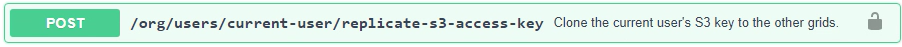

= Clonar chaves de acesso S3 usando a API
:allow-uri-read: 
:icons: font
:imagesdir: ../media/

[role="lead"]
Se sua conta de locatário tiver a permissão *Usar conexão de federação de grade*, você poderá usar a API de gerenciamento de locatários para clonar manualmente as chaves de acesso do S3 do locatário na grade de origem para o locatário na grade de destino.

.Antes de começar
* A conta do locatário tem a permissão *Usar conexão de federação de grade*.
* A conexão da federação de rede tem um *Status de conexão* de *Conectado*.
* Você está conectado ao Tenant Manager na grade de origem do inquilino usando umlink:../admin/web-browser-requirements.html["navegador da web compatível"] .
* Você pertence a um grupo de usuários que tem olink:tenant-management-permissions.html["Gerencie suas próprias credenciais S3 ou permissão de acesso Root"] .
* Se você estiver clonando chaves de acesso para um usuário local, o usuário já existe em ambas as grades.
+

NOTE: Quando você clona chaves de acesso S3 para um usuário federado, tanto o usuário quanto as chaves de acesso S3 são adicionadas ao locatário de destino.

== Clone suas próprias chaves de acesso

Você pode clonar suas próprias chaves de acesso se precisar acessar os mesmos buckets em ambas as grades.

.Passos
. Usando o Tenant Manager na grade de origem,link:creating-your-own-s3-access-keys.html["crie suas próprias chaves de acesso"] e baixe o `.csv` arquivo.
. Na parte superior do Gerenciador de Tenants, selecione o ícone de ajuda e selecione *Documentação da API*.
. Na seção *s3*, selecione o seguinte ponto de extremidade:
+
`POST /org/users/current-user/replicate-s3-access-key`

+

. Selecione *Experimentar*.
. Na caixa de texto *body*, substitua as entradas de exemplo para *accessKey* e *secretAccessKey* pelos valores do arquivo *.csv* que você baixou.
+
Certifique-se de manter as aspas duplas em torno de cada string.

+
image::../media/grid-federation-clone-access-key.png[API do Tenant Manager inserindo valores para clonar a chave de acesso]

. Se a chave expirar, substitua a entrada de exemplo para *expires* pela data e hora de expiração como uma sequência de caracteres no formato de data e hora ISO 8601 (por exemplo, `2024-02-28T22:46:33-08:00` ).  Se a chave não expirar, insira *null* como valor para a entrada *expires* (ou remova a linha *Expires* e a vírgula anterior).
. Selecione *Executar*.
. Confirme se o código de resposta do servidor é *204*, indicando que a chave foi clonada com sucesso para a grade de destino.

== Clonar as chaves de acesso de outro usuário

Você pode clonar as chaves de acesso de outro usuário se ele precisar acessar os mesmos buckets em ambas as grades.

.Passos
. Usando o Tenant Manager na grade de origem,link:creating-another-users-s3-access-keys.html["crie as chaves de acesso S3 do outro usuário"] e baixe o `.csv` arquivo.
. Na parte superior do Gerenciador de Tenants, selecione o ícone de ajuda e selecione *Documentação da API*.
. Obtenha o ID do usuário.  Você precisará desse valor para clonar as chaves de acesso do outro usuário.
+
.. Na seção *usuários*, selecione o seguinte endpoint:
+
`GET /org/users`

.. Selecione *Experimentar*.
.. Especifique quaisquer parâmetros que você deseja usar ao pesquisar usuários.
.. Selecione *Executar*.
.. Encontre o usuário cujas chaves você deseja clonar e copie o número no campo *id*.

. Na seção *s3*, selecione o seguinte ponto de extremidade:
+
`POST /org/users/{userId}/replicate-s3-access-key`

+
image::../media/grid-federation-post-other-user.png[Ponto de extremidade POST para replicar a chave de acesso de outro usuário]

. Selecione *Experimentar*.
. Na caixa de texto *userId*, cole o ID do usuário que você copiou.
. Na caixa de texto *corpo*, substitua as entradas de exemplo para *chave de acesso de exemplo* e *chave de acesso secreta* pelos valores do arquivo *.csv* desse usuário.
+
Certifique-se de manter as aspas duplas ao redor da string.

. Se a chave expirar, substitua a entrada de exemplo para *expires* pela data e hora de expiração como uma sequência de caracteres no formato de data e hora ISO 8601 (por exemplo, `2023-02-28T22:46:33-08:00` ).  Se a chave não expirar, insira *null* como valor para a entrada *expires* (ou remova a linha *Expires* e a vírgula anterior).
. Selecione *Executar*.
. Confirme se o código de resposta do servidor é *204*, indicando que a chave foi clonada com sucesso para a grade de destino.

