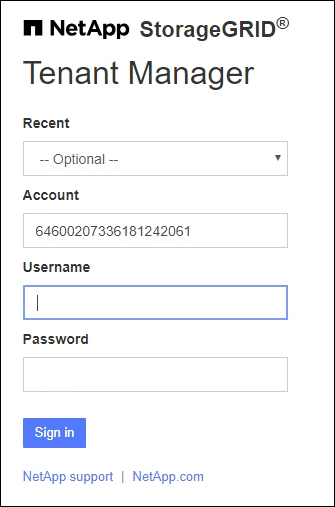

= Sign in no Gerenciador de Inquilinos
:allow-uri-read: 
:icons: font
:imagesdir: ../media/

[role="lead"]
Você acessa o Tenant Manager inserindo a URL do inquilino na barra de endereço de umlink:../admin/web-browser-requirements.html["navegador da web compatível"] .

.Antes de começar
* Você tem suas credenciais de login.
* Você tem uma URL para acessar o Gerenciador de Tenants, fornecida pelo administrador da sua grade.  O URL será semelhante a um destes exemplos:
+
`\https://FQDN_or_Admin_Node_IP/`

+
`\https://FQDN_or_Admin_Node_IP:port/`

+
`\https://FQDN_or_Admin_Node_IP/?accountId=20-digit-account-id`

+
`\https://FQDN_or_Admin_Node_IP:port/?accountId=20-digit-account-id`

+
A URL sempre inclui um nome de domínio totalmente qualificado (FQDN), o endereço IP de um nó administrativo ou o endereço IP virtual de um grupo HA de nós administrativos.  Também pode incluir um número de porta, o ID da conta do locatário de 20 dígitos ou ambos.

* Se a URL não incluir o ID da conta de 20 dígitos do locatário, você terá esse ID de conta.
* Você está usando umlink:../admin/web-browser-requirements.html["navegador da web compatível"] .
* Os cookies estão habilitados no seu navegador.
* Você pertence a um grupo de usuários que temlink:tenant-management-permissions.html["permissões de acesso específicas"] .

.Passos
. Lançar umlink:../admin/web-browser-requirements.html["navegador da web compatível"] .
. Na barra de endereço do navegador, digite o URL para acessar o Tenant Manager.
. Se você receber um alerta de segurança, instale o certificado usando o assistente de instalação do navegador.
. Sign in no Gerenciador de Inquilinos.
+
A tela de login exibida depende do URL inserido e se o logon único (SSO) foi configurado para o StorageGRID.

+
[role="tabbed-block"]
====
.Não usar SSO
--
Se o StorageGRID não estiver usando SSO, uma das seguintes telas será exibida:

** Página de login do Grid Manager.  Selecione o link *Login do locatário*.
+
image::../media/tenant_login_link.png[Link de login do locatário na página de login do Grid Manager]

** Página de login do Gerenciador de inquilinos. O campo *Conta* pode já estar preenchido, conforme mostrado abaixo.
+

+
... Se o ID da conta de 20 dígitos do locatário não for exibido, selecione o nome da conta do locatário se ele aparecer na lista de contas recentes ou insira o ID da conta.
... Digite seu nome de usuário e senha.
... Selecione * Sign in*.
+
O painel do Gerenciador de inquilinos é exibido.

... Se você recebeu uma senha inicial de outra pessoa, selecione *_nome de usuário_* > *Alterar senha* para proteger sua conta.

--
.Usando SSO
--
Se o StorageGRID estiver usando SSO, uma das seguintes telas será exibida:

** Página SSO da sua organização. Por exemplo:
+
image::../media/sso_organization_page.gif[Exemplo de página de login da organização para SSO]

+
Insira suas credenciais SSO padrão e selecione * Sign in*.

** Página de login do Tenant Manager SSO.
+
image::../media/sign_in_sso.png[Fazer login em uma conta de locatário se o SSO estiver habilitado]

+
... Se o ID da conta de 20 dígitos do locatário não for exibido, selecione o nome da conta do locatário se ele aparecer na lista de contas recentes ou insira o ID da conta.
... Selecione * Sign in*.
... Sign in com suas credenciais SSO padrão na página de login SSO da sua organização.
+
O painel do Gerenciador de inquilinos é exibido.

--
====

