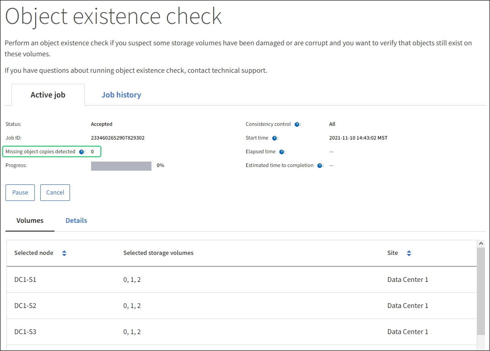

= Verificar integridade do objeto
:allow-uri-read: 
:icons: font
:imagesdir: ../media/

[role="lead"]
O sistema StorageGRID verifica a integridade dos dados de objetos nos nós de armazenamento, verificando se há objetos corrompidos e ausentes.

Existem dois processos de verificação: verificação em segundo plano e verificação de existência de objetos (anteriormente chamada de verificação em primeiro plano).  Eles trabalham juntos para garantir a integridade dos dados.  A verificação de antecedentes é executada automaticamente e verifica continuamente a exatidão dos dados do objeto.  A verificação de existência de objetos pode ser acionada por um usuário para verificar mais rapidamente a existência (mas não a exatidão) dos objetos.

== O que é verificação de antecedentes?

O processo de verificação em segundo plano verifica automática e continuamente os nós de armazenamento em busca de cópias corrompidas de dados de objetos e tenta reparar automaticamente quaisquer problemas encontrados.

A verificação de antecedentes verifica a integridade de objetos replicados e objetos codificados para eliminação, da seguinte forma:

* *Objetos replicados*: Se o processo de verificação em segundo plano encontrar um objeto replicado corrompido, a cópia corrompida será removida de seu local e colocada em quarentena em outro lugar no nó de armazenamento.  Em seguida, uma nova cópia não corrompida é gerada e colocada para satisfazer as políticas ativas do ILM.  A nova cópia pode não ser colocada no nó de armazenamento que foi usado para a cópia original.

NOTE: Dados de objetos corrompidos são colocados em quarentena em vez de excluídos do sistema, para que ainda possam ser acessados.  Para obter mais informações sobre como acessar dados de objetos em quarentena, entre em contato com o suporte técnico.

* *Objetos com codificação de eliminação*: Se o processo de verificação em segundo plano detectar que um fragmento de um objeto com codificação de eliminação está corrompido, o StorageGRID tenta automaticamente reconstruir o fragmento ausente no mesmo nó de armazenamento, usando os dados restantes e os fragmentos de paridade.  Se o fragmento corrompido não puder ser reconstruído, será feita uma tentativa de recuperar outra cópia do objeto.  Se a recuperação for bem-sucedida, uma avaliação do ILM será realizada para criar uma cópia de substituição do objeto codificado para eliminação.
+
O processo de verificação em segundo plano verifica objetos somente em nós de armazenamento.  Ele não verifica objetos em um pool de armazenamento em nuvem.  Os objetos devem ter mais de quatro dias para se qualificarem para verificação de antecedentes.

A verificação de antecedentes é executada em uma taxa contínua e projetada para não interferir nas atividades normais do sistema.  A verificação de antecedentes não pode ser interrompida.  No entanto, você pode aumentar a taxa de verificação em segundo plano para verificar mais rapidamente o conteúdo de um nó de armazenamento se suspeitar de um problema.

=== Alertas relacionados à verificação de antecedentes

Se o sistema detectar um objeto corrompido que não pode ser corrigido automaticamente (porque a corrupção impede que o objeto seja identificado), o alerta *Objeto corrompido não identificado detectado* será acionado.

Se a verificação de antecedentes não puder substituir um objeto corrompido porque não consegue localizar outra cópia, o alerta *Objetos perdidos* será acionado.

=== Alterar a taxa de verificação de antecedentes

Você pode alterar a taxa na qual a verificação em segundo plano verifica os dados de objetos replicados em um nó de armazenamento se tiver preocupações sobre a integridade dos dados.

.Antes de começar
* Você deve estar conectado ao Grid Manager usando umlink:../admin/web-browser-requirements.html["navegador da web compatível"] .
* Você temlink:../admin/admin-group-permissions.html["permissões de acesso específicas"] .

.Sobre esta tarefa
Você pode alterar a Taxa de Verificação para verificação em segundo plano em um Nó de Armazenamento:

* Adaptável: configuração padrão.  A tarefa foi projetada para verificar no máximo 4 MB/s ou 10 objetos/s (o que for excedido primeiro).
* Alto: a verificação do armazenamento ocorre rapidamente, a uma taxa que pode retardar as atividades comuns do sistema.

Use a taxa de verificação Alta somente quando suspeitar que uma falha de hardware ou software pode ter corrompido os dados do objeto.  Após a conclusão da verificação de antecedentes de alta prioridade, a Taxa de verificação é redefinida automaticamente para Adaptável.

.Passos
. Selecione *SUPORTE* > *Ferramentas* > *Topologia de grade*.
. Selecione *_Nó de armazenamento_* > *LDR* > *Verificação*.
. Selecione *Configuração* > *Principal*.
. Vá para *LDR* > *Verificação* > *Configuração* > *Principal*.
. Em Verificação de antecedentes, selecione *Taxa de verificação* > *Alta* ou *Taxa de verificação* > *Adaptável*.
+
image::../media/background_verification_rate.png[definindo taxa de verificação]

. Clique em *Aplicar alterações*.
. Monitore os resultados da verificação de antecedentes para objetos replicados.
+
.. Vá para *NÓS* > *_Nó de Armazenamento_* > *Objetos*.
.. Na seção Verificação, monitore os valores para *Objetos Corrompidos* e *Objetos Corrompidos Não Identificados*.
+
Se a verificação de antecedentes encontrar dados de objetos replicados corrompidos, a métrica *Objetos Corrompidos* será incrementada e o StorageGRID tentará extrair o identificador de objeto dos dados, da seguinte maneira:

+
*** Se o identificador do objeto puder ser extraído, o StorageGRID criará automaticamente uma nova cópia dos dados do objeto.  A nova cópia pode ser feita em qualquer lugar no sistema StorageGRID que satisfaça as políticas de ILM ativas.
*** Se o identificador do objeto não puder ser extraído (porque foi corrompido), a métrica *Objetos corrompidos não identificados* será incrementada e o alerta *Objeto corrompido não identificado detectado* será acionado.

.. Se forem encontrados dados de objetos replicados corrompidos, entre em contato com o suporte técnico para determinar a causa raiz da corrupção.

. Monitore os resultados da verificação de antecedentes para objetos codificados por eliminação.
+
Se a verificação de antecedentes encontrar fragmentos corrompidos de dados de objetos codificados para eliminação, o atributo Fragmentos Corrompidos Detectados será incrementado.  O StorageGRID se recupera reconstruindo o fragmento corrompido no mesmo nó de armazenamento.

+
.. Selecione *SUPORTE* > *Ferramentas* > *Topologia de grade*.
.. Selecione *_Nó de Armazenamento_* > *LDR* > *Codificação de Apagamento*.
.. Na tabela Resultados da Verificação, monitore o atributo Fragmentos Corrompidos Detectados (ECCD).

. Depois que os objetos corrompidos forem restaurados automaticamente pelo sistema StorageGRID , redefina a contagem de objetos corrompidos.
+
.. Selecione *SUPORTE* > *Ferramentas* > *Topologia de grade*.
.. Selecione *_Nó de armazenamento_* > *LDR* > *Verificação* > *Configuração*.
.. Selecione *Redefinir contagem de objetos corrompidos*.
.. Clique em *Aplicar alterações*.

. Se tiver certeza de que os objetos em quarentena não são necessários, você pode excluí-los.
+

NOTE: Se o alerta *Objetos perdidos* for acionado, o suporte técnico pode querer acessar os objetos em quarentena para ajudar a depurar o problema subjacente ou tentar recuperar os dados.

+
.. Selecione *SUPORTE* > *Ferramentas* > *Topologia de grade*.
.. Selecione *_Nó de armazenamento_* > *LDR* > *Verificação* > *Configuração*.
.. Selecione *Excluir objetos em quarentena*.
.. Selecione *Aplicar alterações*.

== O que é verificação de existência de objetos?

A verificação de existência de objetos verifica se todas as cópias replicadas esperadas de objetos e fragmentos codificados para eliminação existem em um nó de armazenamento.  A verificação de existência do objeto não verifica os dados do objeto em si (a verificação em segundo plano faz isso); em vez disso, ela fornece uma maneira de verificar a integridade dos dispositivos de armazenamento, especialmente se um problema recente de hardware pode ter afetado a integridade dos dados.

Ao contrário da verificação de antecedentes, que ocorre automaticamente, você deve iniciar manualmente um trabalho de verificação de existência de objeto.

A verificação de existência de objetos lê os metadados de cada objeto armazenado no StorageGRID e verifica a existência de cópias de objetos replicadas e fragmentos de objetos codificados para eliminação.  Quaisquer dados ausentes são tratados da seguinte forma:

* *Cópias replicadas*: Se uma cópia dos dados do objeto replicado estiver faltando, o StorageGRID tentará automaticamente substituir a cópia por uma cópia armazenada em outro lugar no sistema.  O nó de armazenamento executa uma cópia existente por meio de uma avaliação de ILM, que determinará que a política de ILM atual não está mais sendo atendida para este objeto porque outra cópia está faltando.  Uma nova cópia é gerada e colocada para satisfazer as políticas de ILM ativas do sistema.  Esta nova cópia pode não ser colocada no mesmo local onde a cópia ausente foi armazenada.
* *Fragmentos codificados por eliminação*: se um fragmento de um objeto codificado por eliminação estiver ausente, o StorageGRID tenta reconstruir automaticamente o fragmento ausente no mesmo nó de armazenamento usando os fragmentos restantes.  Se o fragmento ausente não puder ser reconstruído (porque muitos fragmentos foram perdidos), o ILM tenta encontrar outra cópia do objeto, que pode ser usada para gerar um novo fragmento codificado por apagamento.

=== Executar verificação de existência de objeto

Você cria e executa uma tarefa de verificação de existência de objeto por vez.  Ao criar um trabalho, você seleciona os nós de armazenamento e os volumes que deseja verificar.  Você também seleciona a consistência do trabalho.

.Antes de começar
* Você está conectado ao Grid Manager usando umlink:../admin/web-browser-requirements.html["navegador da web compatível"] .
* Você tem olink:../admin/admin-group-permissions.html["Permissão de acesso de manutenção ou root"] .
* Você garantiu que os nós de armazenamento que deseja verificar estão online. Selecione *NÓS* para visualizar a tabela de nós. Certifique-se de que nenhum ícone de alerta apareça ao lado do nome do nó para os nós que você deseja verificar.
* Você garantiu que os seguintes procedimentos *não* estão em execução nos nós que deseja verificar:
+
** Expansão da grade para adicionar um nó de armazenamento
** Desativação do nó de armazenamento
** Recuperação de um volume de armazenamento com falha
** Recuperação de um nó de armazenamento com uma unidade de sistema com falha
** Reequilíbrio da CE
** Clone do nó do dispositivo

A verificação de existência do objeto não fornece informações úteis enquanto esses procedimentos estão em andamento.

.Sobre esta tarefa
Uma tarefa de verificação de existência de objeto pode levar dias ou semanas para ser concluída, dependendo do número de objetos na grade, dos nós e volumes de armazenamento selecionados e da consistência selecionada.  Você pode executar apenas uma tarefa por vez, mas pode selecionar vários nós de armazenamento e volumes ao mesmo tempo.

.Passos
. Selecione *MANUTENÇÃO* > *Tarefas* > *Verificação de existência de objeto*.
. Selecione *Criar trabalho*.  O assistente Criar uma tarefa de verificação de existência de objeto é exibido.
. Selecione os nós que contêm os volumes que você deseja verificar.  Para selecionar todos os nós on-line, marque a caixa de seleção *Nome do nó* no cabeçalho da coluna.
+
Você pode pesquisar por nome do nó ou site.

+
Você não pode selecionar nós que não estejam conectados à grade.

. Selecione *Continuar*.
. Selecione um ou mais volumes para cada nó na lista.  Você pode pesquisar volumes usando o número do volume de armazenamento ou o nome do nó.
+
Para selecionar todos os volumes para cada nó selecionado, marque a caixa de seleção *Volume de armazenamento* no cabeçalho da coluna.

. Selecione *Continuar*.
. Selecione a consistência para o trabalho.
+
A consistência determina quantas cópias de metadados do objeto são usadas para a verificação da existência do objeto.

+
** *Strong-site*: Duas cópias de metadados em um único site.
** *Strong-global*: Duas cópias de metadados em cada site.
** *Todos* (padrão): Todas as três cópias de metadados em cada site.
+
Para obter mais informações sobre consistência, consulte as descrições no assistente.

. Selecione *Continuar*.
. Revise e verifique suas seleções.  Você pode selecionar *Anterior* para ir para uma etapa anterior no assistente e atualizar suas seleções.
+
Um trabalho de verificação de existência de objeto é gerado e executado até que ocorra uma das seguintes situações:

+
** O trabalho foi concluído.
** Você pausa ou cancela o trabalho.  Você pode retomar um trabalho que foi pausado, mas não pode retomar um trabalho que foi cancelado.
** O trabalho estagna.  O alerta *A verificação de existência do objeto foi interrompida* é acionado.  Siga as ações corretivas especificadas para o alerta.
** O trabalho falha.  O alerta *Falha na verificação de existência do objeto* é acionado.  Siga as ações corretivas especificadas para o alerta.
** Aparece uma mensagem "Serviço indisponível" ou "Erro interno do servidor".  Após um minuto, atualize a página para continuar monitorando o trabalho.
+

NOTE: Conforme necessário, você pode sair da página de verificação de existência do objeto e retornar para continuar monitorando o trabalho.

. Conforme o trabalho é executado, visualize a guia *Trabalho ativo* e observe o valor de Cópias de objetos ausentes detectadas.
+
Este valor representa o número total de cópias ausentes de objetos replicados e objetos codificados por eliminação com um ou mais fragmentos ausentes.

+
Se o número de cópias de objetos ausentes detectadas for maior que 100, pode haver um problema com o armazenamento do nó de armazenamento.

+

. Após a conclusão do trabalho, execute quaisquer ações adicionais necessárias:
+
** Se o número de cópias de objetos ausentes detectadas for zero, nenhum problema foi encontrado.  Nenhuma ação é necessária.
** Se o número de cópias de objetos ausentes detectadas for maior que zero e o alerta *Objetos perdidos* não tiver sido acionado, todas as cópias ausentes foram reparadas pelo sistema. Verifique se quaisquer problemas de hardware foram corrigidos para evitar danos futuros às cópias de objetos.
** Se o número de cópias de objetos ausentes detectadas for maior que zero e o alerta *Objetos perdidos* tiver sido acionado, a integridade dos dados poderá ser afetada. Entre em contato com o suporte técnico.
** Você pode investigar cópias de objetos perdidos usando grep para extrair as mensagens de auditoria LLST: `grep LLST audit_file_name` .
+
Este procedimento é semelhante ao delink:../troubleshoot/investigating-lost-objects.html["investigando objetos perdidos"] , embora para cópias de objetos você procure por `LLST` em vez de `OLST` .

. Se você selecionou a consistência strong-site ou strong-global para o trabalho, aguarde aproximadamente três semanas pela consistência dos metadados e execute o trabalho novamente nos mesmos volumes.
+
Quando o StorageGRID tiver tempo para atingir a consistência de metadados para os nós e volumes incluídos no trabalho, a nova execução do trabalho poderá limpar cópias de objetos ausentes relatadas erroneamente ou fazer com que cópias adicionais de objetos sejam verificadas se estiverem ausentes.

+
.. Selecione *MANUTENÇÃO* > *Verificação de existência do objeto* > *Histórico de tarefas*.
.. Determine quais tarefas estão prontas para serem executadas novamente:
+
... Veja a coluna *Hora de término* para determinar quais tarefas foram executadas há mais de três semanas.
... Para esses trabalhos, verifique a coluna Controle de consistência para strong-site ou strong-global.

.. Marque a caixa de seleção de cada tarefa que você deseja executar novamente e selecione *Executar novamente*.
+
image::../media/oec_rerun.png[Repetição do OEC]

.. No assistente de execução repetida de trabalhos, revise os nós e volumes selecionados e a consistência.
.. Quando estiver pronto para executar novamente os trabalhos, selecione *Executar novamente*.

A guia Trabalho ativo é exibida.  Todos os trabalhos selecionados serão executados novamente como um único trabalho com consistência de strong-site.  Um campo *Trabalhos relacionados* na seção Detalhes lista os IDs dos trabalhos originais.

.Depois que você terminar
Se você ainda tiver dúvidas sobre a integridade dos dados, vá para *SUPORTE* > *Ferramentas* > *Topologia de grade* > *_site_* > *_Nó de armazenamento_* > *LDR* > *Verificação* > *Configuração* > *Principal* e aumente a Taxa de verificação em segundo plano.  A verificação de antecedentes verifica a exatidão de todos os dados de objetos armazenados e repara quaisquer problemas encontrados.  Encontrar e reparar possíveis problemas o mais rápido possível reduz o risco de perda de dados.
